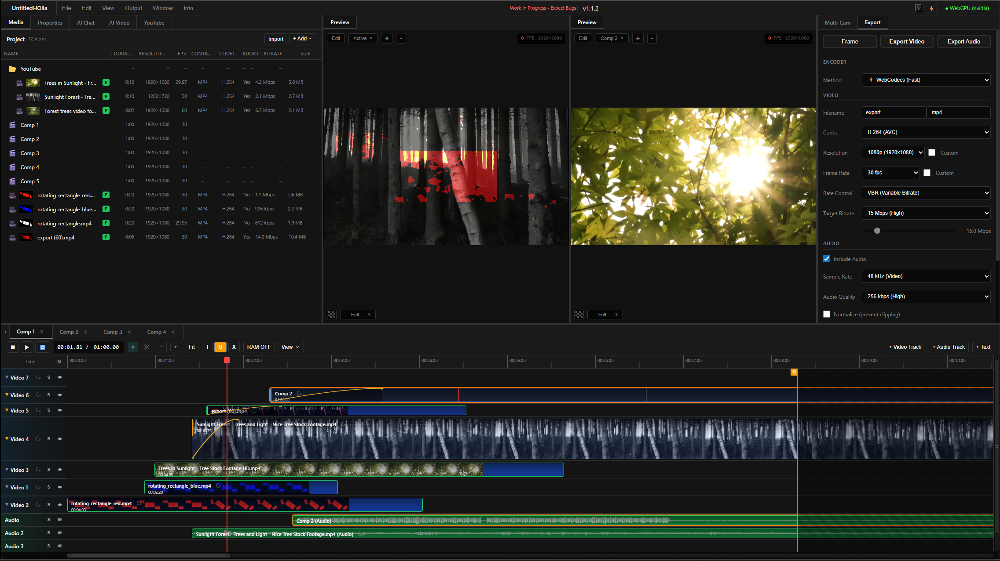
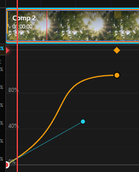

<div align="center">

# MASterSelects

### Professional WebGPU Video Compositor & Timeline Editor

[](https://github.com/Sportinger/MASterSelects/releases)
[](LICENSE)
[](#)
[](https://react.dev)
[](https://www.typescriptlang.org)

A browser-based video editing application with After Effects-style compositing,<br>
AI-powered workflows, and real-time GPU rendering.<br>
**No plugins or installations required.**

[Features](#features) • [Quick Start](#quick-start) • [Documentation](docs/Features/README.md) • [Shortcuts](docs/Features/Keyboard-Shortcuts.md)

<br>



</div>

---

## Features

| Feature | Description | Docs |
|---------|-------------|------|
| **Multi-track Timeline** | Video and audio tracks with nested compositions | [Timeline](docs/Features/Timeline.md) |
| **Cut Tool & Copy/Paste** | C to split clips, Ctrl+C/V to copy/paste | [Timeline](docs/Features/Timeline.md) |
| **Keyframe Animation** | Bezier curve editor with 5 easing modes | [Keyframes](docs/Features/Keyframes.md) |
| **Bezier Fade Curves** | Visual opacity fades with real-time preview | [Timeline](docs/Features/Timeline.md) |
| **37 Blend Modes** | All After Effects blend modes (Numpad +/- to cycle) | [Effects](docs/Features/Effects.md) |
| **30+ GPU Effects** | Color, blur, distort, stylize, keying effects | [Effects](docs/Features/Effects.md) |
| **Text Clips** | Typography with 50 Google Fonts, stroke, shadow | [Text Clips](docs/Features/Text-Clips.md) |
| **Vector Masks** | Rectangle, ellipse, pen tool with GPU feathering | [Masks](docs/Features/Masks.md) |
| **AI Integration** | 50+ editing tools via GPT-4/GPT-5 | [AI Integration](docs/Features/AI-Integration.md) |
| **AI Video Generation** | PiAPI integration for AI video creation | [AI Integration](docs/Features/AI-Integration.md) |
| **YouTube Integration** | Search, download with quality selection | [YouTube](docs/Features/YouTube.md) |
| **10-Band EQ** | Parametric equalizer with keyframe support | [Audio](docs/Features/Audio.md) |
| **Multicam Sync** | Audio-based cross-correlation synchronization | [Audio](docs/Features/Audio.md) |
| **RAM Preview** | Cached playback at 60fps with auto frame caching | [Preview](docs/Features/Preview.md) |
| **Export System V2** | Parallel decoding, shared decoder pool | [Export](docs/Features/Export.md) |
| **Native Helper** | Hardware-accelerated ProRes/DNxHD | [Native Helper](docs/Features/Native-Helper.md) |

<details>
<summary><b>Keyframe Animation with Bezier Curves</b></summary>
<br>

</details>

---

## Quick Start

```bash
npm install
npm run dev     # http://localhost:5173
```

### Requirements

| Requirement | Minimum | Recommended |
|-------------|---------|-------------|
| **Browser** | Chrome 113+ / Edge 113+ | Chrome 120+ |
| **GPU** | Integrated | Dedicated GPU |
| **RAM** | 8GB | 16GB |

> **Linux Users:** Enable Vulkan for 60fps: `chrome://flags/#enable-vulkan`

---

## Tech Stack

<table>
<tr>
<td width="50%">

**Frontend**
- React 19 + TypeScript
- Vite 7.2 (Build & HMR)
- Zustand (State Management)

**Rendering**
- WebGPU + WGSL Shaders
- WebCodecs (Decode/Encode)
- FFmpeg WASM (ProRes, DNxHR)

</td>
<td width="50%">

**Audio**
- Web Audio API
- 10-Band Parametric EQ
- Varispeed Scrubbing

**Services**
- OpenAI GPT-4/GPT-5
- File System Access API
- Native Helper (Rust)

</td>
</tr>
</table>

---

## Architecture

```
┌─────────────────────────────────────────────────────────────────┐
│                         UI Layer (React)                         │
│  Timeline │ Preview │ Media │ Properties │ AI Chat │ YouTube    │
├─────────────────────────────────────────────────────────────────┤
│                      State Layer (Zustand)                       │
│  timelineStore │ mediaStore │ multicamStore │ youtubeStore      │
├─────────────────────────────────────────────────────────────────┤
│                     Engine Layer (WebGPU)                        │
│  Compositor │ Effects │ Masks │ Export │ Parallel Decode        │
├─────────────────────────────────────────────────────────────────┤
│                      Services Layer                              │
│  Audio │ AI Tools │ Whisper │ Project │ Native Helper           │
└─────────────────────────────────────────────────────────────────┘
```

---

## Key Shortcuts

| Key | Action | | Key | Action |
|-----|--------|---|-----|--------|
| `Space` | Play/Pause | | `Ctrl+C` | Copy clips |
| `C` | Cut at playhead | | `Ctrl+V` | Paste clips |
| `I` / `O` | In/Out points | | `Ctrl+Z` | Undo |
| `Delete` | Delete selected | | `Ctrl+S` | Save project |

[Full shortcut reference →](docs/Features/Keyboard-Shortcuts.md)

---

## Panel System

<table>
<tr>
<td width="50%">

| Panel | Purpose |
|-------|---------|
| **Preview** | Output canvas with quality settings |
| **Timeline** | Multi-track editor |
| **Media** | Browser with folders |
| **Properties** | Transform, Effects, Masks |
| **Export** | Fast/Precise/FFmpeg modes |

</td>
<td width="50%">

| Panel | Purpose |
|-------|---------|
| **Multicam** | Audio sync |
| **AI Chat** | GPT editing assistant |
| **AI Video** | PiAPI video generation |
| **YouTube** | Search & download |
| **Slots** | Layer management |

</td>
</tr>
</table>

---

## Documentation

| Category | Links |
|----------|-------|
| **Core** | [Timeline](docs/Features/Timeline.md) • [Keyframes](docs/Features/Keyframes.md) • [Effects](docs/Features/Effects.md) • [Masks](docs/Features/Masks.md) |
| **Media** | [Media Panel](docs/Features/Media-Panel.md) • [Audio](docs/Features/Audio.md) • [Preview](docs/Features/Preview.md) |
| **AI & Export** | [AI Integration](docs/Features/AI-Integration.md) • [Export](docs/Features/Export.md) • [YouTube](docs/Features/YouTube.md) |
| **System** | [UI & Panels](docs/Features/UI-Panels.md) • [GPU Engine](docs/Features/GPU-Engine.md) • [Project Persistence](docs/Features/Project-Persistence.md) |

---

## Development

```bash
npm run dev      # Development server
npm run build    # Production build
npm run lint     # ESLint check
```

<details>
<summary><b>Project Structure</b></summary>

```
src/
├── components/        # React components
│   ├── timeline/      # Timeline editor
│   ├── panels/        # Dock panels
│   ├── preview/       # Preview canvas
│   └── dock/          # Panel system
├── stores/            # Zustand state
│   ├── timeline/      # Timeline slices
│   └── mediaStore/    # Media slices
├── engine/            # WebGPU rendering
│   ├── core/          # WebGPU context
│   ├── render/        # Compositor
│   ├── export/        # Frame exporter
│   └── audio/         # Audio processing
├── effects/           # 30+ GPU effects
├── shaders/           # WGSL shaders
└── services/          # Audio, AI, Project
```

</details>

<details>
<summary><b>Debugging with Logger</b></summary>

```javascript
Logger.enable('WebGPU,Export')  // Enable modules
Logger.setLevel('DEBUG')        // Show all levels
Logger.search('device')         // Search logs
Logger.dump(50)                 // Print last 50
```

</details>

---

<div align="center">

**[MIT License](LICENSE)** • Made with WebGPU

</div>
