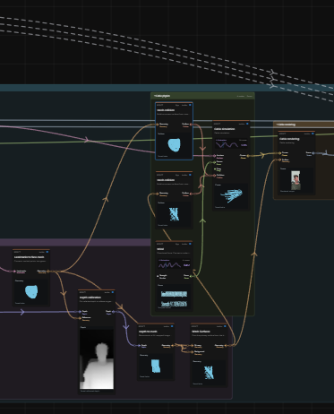
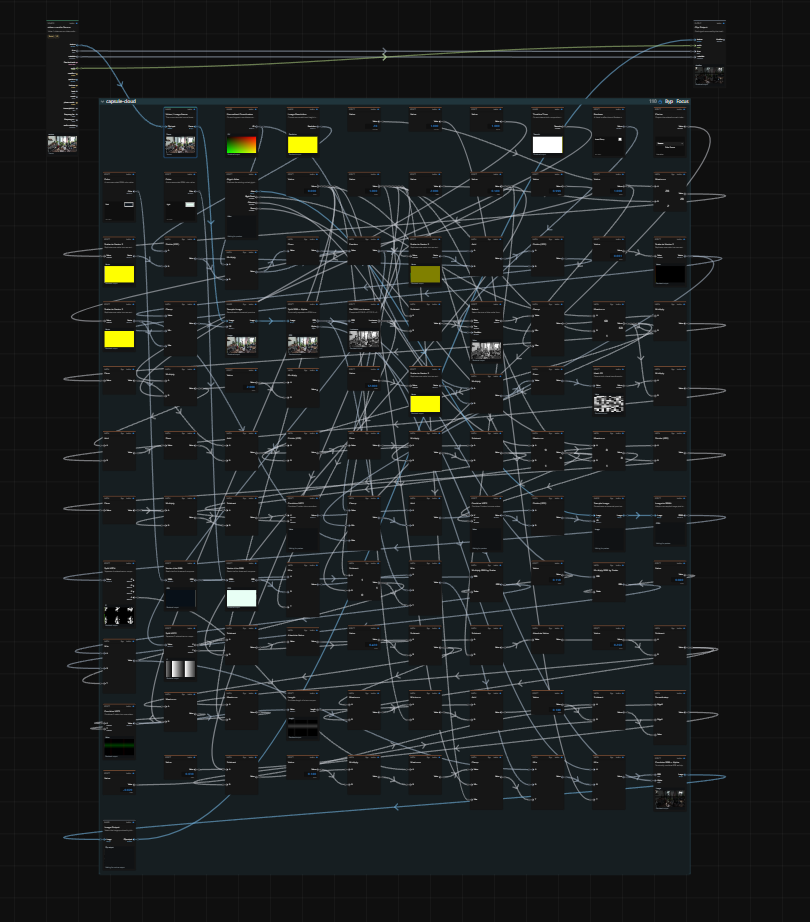

# MasterSelects

A browser-based video editor and a workspace you can extend while you create.
Edit video, mix audio, animate graphics, build 3D scenes, and work with AI in one multitrack timeline. The editor runs on React, TypeScript, WebGPU, and WebCodecs.

[Open the editor](https://www.masterselects.com/) · [Documentation](https://www.masterselects.com/docs/) · [Discord](https://discord.com/invite/K8dApzG3XC) · [Report an issue](https://github.com/Sportinger/MasterSelects/issues)


*Face Cables combines face tracking, animated controls, and optional scene depth. See the [feature guide](docs/Features/README.md) for this and other workflows.*

## What you can make

| Workspace | Highlights |
| --- | --- |
| **Video** | Multitrack editing, nested compositions, proxies, multicam, and Premiere Pro sequence import. |
| **Nodes** | Build and reuse effect, color, geometry, and 3D graphs with typed connections and live previews. |
| **Color & effects** | Grade footage, combine GPU effects and transitions, and animate masks and properties. |
| **Audio** | Edit waveforms, mix tracks, record, apply effects, and separate stems. |
| **Motion & tracking** | Animate text and shapes, create captions, and attach graphics to tracked footage. |
| **3D** | Combine footage, models, lights, cameras, Gaussian splats, and particle effects. |
| **AI** | Ask the in-app agent to edit the timeline or generate media. A dismissible Clippy overlay offers a large “inside me” input that opens your draft in AI chat. Node work opens beside Preview, with the view following the animated groups. |

### Node graphs

| Detail view | Full graph |
| --- | --- |
| <a href="docs/images/node-graph-detail.png"></a> | <a href="docs/images/node-graph-overview.png"></a> |

Import video, audio, images, animations, 3D assets, and Premiere Pro projects. Export video, audio, still frames, and interchange formats. Browser, operating system, and GPU support affect available codecs and performance. See [media import](docs/Features/Media-Panel.md) and [export](docs/Features/Export.md).

## Build while you create

Dense [mask overlays](docs/Features/Masks.md) reuse contour transforms and interpolated paths during interaction. [Project recovery](docs/Features/Project-Persistence.md) retains recent entries when folder access fails. Development refreshes proceed without an unsaved-work browser prompt.

[Browser Roto](docs/Features/AI-Integration.md#browser-roto-sam-21) uses local SAM 2.1 video segmentation to select moving objects directly in Preview, watch tracking progress there, refine mask edges, and convert results into animated clip masks or export mask and transparent videos without the Native Helper. Roto masks and corrections survive panel and clip switches within the editor tab; converted clip masks are saved with the project.

I built MasterSelects because I wanted an editor I could shape around a project. When a tool is missing, a coding agent can add an effect, control, or workflow to the source; you can try it in the same project and contribute it for others to use.

The codebase includes [agent instructions](AGENTS.md), [feature documentation](docs/Features/README.md), reusable editor components, and an [authenticated local bridge](docs/Features/AI-Bridge-Control.md) for inspecting and operating the running editor. The hosted AI kernel is maintained separately from this repository.

## Try it

Open [masterselects.com](https://www.masterselects.com/), import a clip, and drag it onto the timeline. Press **Space** to play, **C** to cut, and **Ctrl/Cmd+S** to save. More controls are in the [keyboard shortcuts](docs/Features/Keyboard-Shortcuts.md).

Chrome or Edge on desktop is a good starting point. Editing and rendering run locally in the browser; hosted AI and media generation use external services and may require credits. Local AI features may download models on first use. MasterSelects is under active development, so keep backups of important projects.

## Run locally

An [Android development app](docs/Features/Android-App.md) packages the editor for offline local editing, with Android project-folder selection, media import, export saving/sharing, and online cloud services. Android beta purchases are disabled; existing account credits remain usable. Project folders require Android 17; older Android versions use app-private storage. Build it from the final web build with `node scripts/android.mjs build`; device verification and store release are separate steps.

Install the Node.js version in [`.node-version`](.node-version), then run:

```bash
git clone https://github.com/Sportinger/MasterSelects.git
cd MasterSelects
npm ci
npm run dev
```

Open **http://localhost:5173**. Hosted login, credits, and AI services need the full development stack and separate service configuration. Maintainers with the private kernel checkout can use `npm run dev:full`.

External agents can connect to the local editor with `npm run mcp`; see [AI bridge control](docs/Features/AI-Bridge-Control.md) for setup and access boundaries.

## Contribute

Focused pull requests, reproducible bug reports, and documentation improvements are welcome. For larger features, open an issue first. Read [AGENTS.md](AGENTS.md) for repository conventions and use the [feature guide](docs/Features/README.md) to find the relevant architecture and workflows.

## License

MasterSelects is licensed under **AGPL-3.0-only**. Commercial use is permitted under its terms. Videos and other ordinary media made with the editor do not inherit its license. See [LICENSE](LICENSE), [LICENSING.md](LICENSING.md), and [third-party notices](THIRD_PARTY_NOTICES.md).
