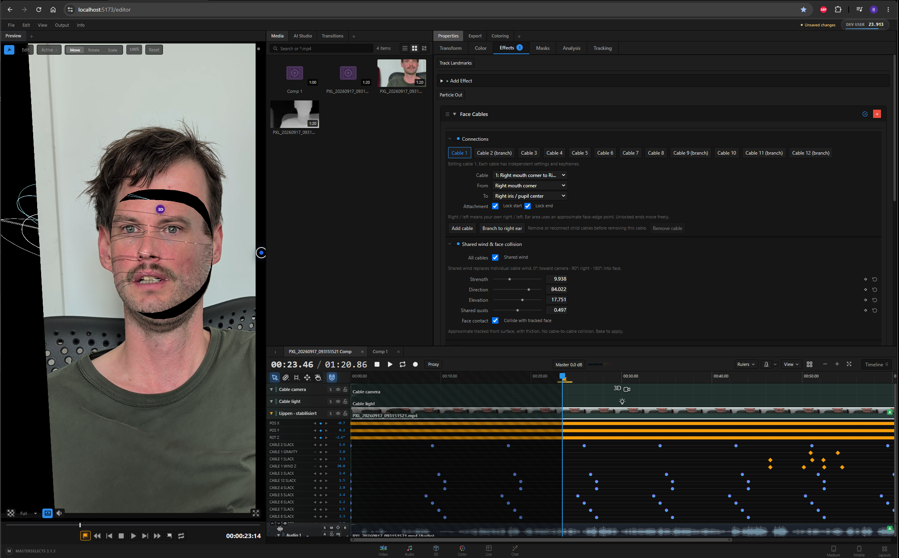

# MasterSelects

A media editor and an agent-friendly foundation for creative tools.

Edit video, mix audio, animate graphics, build 3D scenes, and work with live
visuals. MasterSelects combines these workflows in a browser-based workspace
with WebGPU rendering and a multitrack timeline.

When your project needs a tool that isn't there yet, you can have a coding agent
build it into the editor while you work. Try the new effect, panel, or workflow
in that same project, and refine it around the job in front of you.

[Open the editor](https://www.masterselects.com/) ·
[About MasterSelects](https://www.masterselects.com/about/) ·
[Documentation](https://www.masterselects.com/docs/) ·
[Discord](https://discord.com/invite/K8dApzG3XC) ·
[Report an issue](https://github.com/Sportinger/MasterSelects/issues)



*Face Cables: a custom face-tracking effect with cable physics, editable controls,
and timeline keyframes. Optional AI scene depth gives hair, body and background
a textured 2.5D surface with cable collision while MediaPipe retains the face and
cable anchors. Baked depth stays in the project and can be reused for physics.*

## Why I built this

No Adobe subscription, no patience for cracks, and no template-first online
editor. I wanted a creative workspace I could make my own.

AI should be able to do the edit, and help build the tool itself, right when you
need it. A real project gives you a reason to build something and a place to
try it immediately.

<h3>I want people to contribute the useful things they build. An effect made for
one person's project can become a tool someone else already has when they need
it. As those contributions become part of MasterSelects, both people and their
agents have more to work with, and the next task gets a little easier.</h3>

Meanwhile, I'll keep a refined version available at
[masterselects.com](https://www.masterselects.com/), reviewing and polishing
contributions as I bring them together into a cohesive editor.

## Build while you create

Start the editor locally from source, open your project, and work from there:

1. **Find the missing piece.** A task in your project calls for a new effect,
   control, or workflow.
2. **Build it with your agent.** Let your coding agent add it to the codebase
   while you work on the project.
3. **Use and refine it.** Try it in the same project and adjust it to what the
   work actually needs.
4. **Contribute it back.** Share useful additions so the next person, and their
   agent, can build on them.

See [Run locally](#run-locally) to get started.

## An agent-friendly codebase

The codebase gives coding agents concrete ways to find their bearings, extend
existing systems, and check their work:

- **A map of the project.** [AGENTS.md](AGENTS.md) documents architecture,
  conventions, and verification workflows; the [feature docs](docs/Features/README.md)
  explain how each part of the editor works.
- **Reusable building blocks.** Registered effect modules, shared inspector
  controls, typed tool schemas, and store slices give new features existing
  patterns to build on.
- **Access to the running editor.** The [local MCP bridge](docs/Features/AI-Bridge-Control.md)
  lets agents inspect the timeline, operate tools, and examine results while
  working on the source.
- **Performance diagnostics.** When playback feels slow or laggy, agents can
  sample frame timings, inspect main-thread work, decoder state, cache usage,
  and audio drift, and read playback traces through the bridge. Repeatable
  playback and scrub probes help reproduce a problem and compare changes.
  See [playback debugging](docs/Features/Playback-Debugging.md).
- **9,000+ automated test definitions.** The test suite includes editor behavior,
  project state, tool policy, and architecture checks. Agents can run relevant
  tests as they change the code.

## Make the edit

| Workspace | What you can do |
| --- | --- |
| **Video** | Edit multiple tracks, nest compositions, work with proxies, sync multicam footage, and import Premiere Pro sequences. |
| **Nodes** | One clip canvas with nested groups, executable texture/material/geometry nodes, detailed face/depth processing, synchronized effect controls and a searchable catalog. Smooth, continuous exponential wheel and trackpad zoom stays anchored to the pointer. An OffscreenCanvas worker draws the graph and directional signal animation on separate cached layers. Compact animation areas show existing keyframes directly on their target nodes; extract a keyframe node to share a curve, with its cables revealed on selection. A collapsible Stabilization group exposes landmark conversion, baked transform curves and their clip target, with its own bypass and gray inactive keys in the timeline and curve editors. Executable 3D nodes support bypass, including transforms already recorded in supported Face Cables bakes. Typed ports show accepted formats; Video Source exposes reusable tracking and saved depth alongside audio analysis. |
| **Color & effects** | Grade through Color Nodes or the synchronized Color controls, inspect curves and scopes, combine GPU effects and transitions, and animate masks and properties with keyframes. |
| **Audio** | Edit waveforms and spectrograms, mix tracks with effects and sends, record audio, and separate stems. |
| **Motion & tracking** | Animate text, shapes, Lottie, and Rive assets; create captions; track faces and surfaces; bypass baked face/lip stabilization without deleting keyframes; and attach graphics to tracked motion. |
| **3D** | Combine footage with models, lights, cameras, and Gaussian splats in a shared scene. |
| **AI** | Ask the editor to change the timeline, generate media, or use local transcription, segmentation, and depth estimation. |

Arrange the dockable panels for the work at hand. The interface is optimized for
touch and iPad, with phone workflows still being refined. Multiple preview
outputs support live and installation workflows.

Explore the [feature guide](docs/Features/README.md) for workflows and examples.

Node cables have visible semicircular plugs, animated attachment, and docked ghost
previews over compatible sockets while dragging. Drag either end to reconnect,
or release on empty canvas to unplug editable links.
During playback and timeline scrubbing, light pulses and direction arrows show
the flow from output to input. They fade when the timeline rests.
Graph panning reuses unchanged nodes and cables; playback avoids repeated dock
layout writes, tab measurements and effect evaluation for sibling parameter rows.

Media imports report processing and save failures. Failed audio-proxy writes can
be retried; project packages follow the configured save policy.
Switching compositions keeps cached proxy audio available. Reopening split nested
clips uses the full source composition duration, and nested previews retain the
correct source timing after splits. Precise export skips unused
nested video sources when the selected range and composition timing allow it.
At nested cuts, export waits for the new frame before capture.

Find keyboard shortcuts by action or key combination in Settings. Copy and paste
automation curves to replace the destination range while keeping surrounding
keyframes and other properties intact.
Use **View > Thumbnails** in the timeline to hide or restore clip previews while
keeping clip labels and audio waveforms visible.
Timeline volume keyframe rows and inline curves show gain in dB.
Deleting timeline gaps moves the playhead with the remaining material.
Timeline snapping starts off; hold **Shift** to snap temporarily or enable the
magnet button to keep it on. Your choice is remembered.
**Export Current Frame** saves a JPG at full composition resolution with a black
background, even when the preview uses reduced quality.
Right-button scrubbing scrolls at the timeline edges. Moving clips between tracks
keeps their original timing, and reversed thumbnails follow the visible source range.
Nested audio-only compositions retain their sound; mixdowns include clip timing
and audio processing. Board-to-timeline drops restore the board view after auto-pan.
New compositions are revealed in the Media panel. Preview source menus group
composition layers and expand them on hover, keyboard focus, or a touch toggle.
Board collisions use the nearest free grid position. Reusing Text, Camera, or Mesh
media preserves the item's saved properties. Nested mixdowns refresh when source
timing, effects, automation, or child compositions change. Prompt Book updates
completed tool calls while the chat response is still running.

## Try it

Open [masterselects.com](https://www.masterselects.com/), import a clip, and drag it
onto the timeline. Use **Space** to play, **C** to cut, and **Ctrl/Cmd+S** to save.
See the [keyboard shortcuts](docs/Features/Keyboard-Shortcuts.md) for more.

Use a recent browser with WebGPU support. Chrome or Edge on desktop is a good
starting point. Available codecs, local file access, and performance depend on
your browser, operating system, and GPU.

Editing and rendering run locally. Hosted AI and media generation use external
services and may require credits; local AI features may download models on first
use. See [AI integration](docs/Features/AI-Integration.md) and
[security and privacy boundaries](docs/Features/Security.md).

MasterSelects is under active development. Keep backups of important projects.
When reporting a problem, include your browser, operating system, and steps to
reproduce it.

## Media in, media out

- **Import:** video, audio, images, Premiere Pro projects, Lottie and Rive
  animation, OBJ/glTF/GLB models, and Gaussian splats.
- **Export:** video through WebCodecs or FFmpeg, still frames, audio, and FCPXML
  for interchange with other editors.
- **Optional Native Helper:** adds local services such as downloads, additional
  storage support, and AI sidecars.

Codec support varies by platform; a file extension alone does not guarantee
decoding. Details: [media import](docs/Features/Media-Panel.md),
[export](docs/Features/Export.md), and
[Native Helper setup](tools/native-helper/README.md).

## Run locally

Install the Node.js version in [`.node-version`](.node-version), then:

```bash
git clone https://github.com/Sportinger/MasterSelects.git
cd MasterSelects
npm ci
npm run dev
```

Open **http://localhost:5173**. This starts the browser editor. Hosted login,
credits, and AI services are separate from this local setup.

Development reloads skip the browser's unsaved-work confirmation. Save explicitly
before reloading when using manual save mode.

Maintainers with the service configuration and private kernel checkout can use
`npm run dev:full` for the complete development stack. The private hosted kernel
is maintained separately and is not included in this repository.

External agents can connect to the running development editor through the local,
authenticated MCP bridge:

```bash
npm run mcp
```

See [AI bridge control](docs/Features/AI-Bridge-Control.md) for setup and access
boundaries.

## Contribute

An effect or tool you built for your own project could be useful to others.
Send a focused pull request with a short example of what it does. For a larger
feature, open an issue first to discuss how it fits the editor. Bug reports,
reproducible examples, and documentation improvements are welcome too.

The core stack is **React, TypeScript, Zustand, WebGPU, and WebCodecs**. Start with
`src/components/` for the UI, `src/stores/` for editor state, `src/engine/` for
rendering and export, and `src/services/` for media and integrations.

Read [AGENTS.md](AGENTS.md) for repository conventions. Keep feature documentation
alongside behavior changes and run checks relevant to the files you change:

```bash
npx vitest run tests/unit/<relevant-file>.test.ts
npm run build
```

## License

MasterSelects is licensed under the **GNU Affero General Public License v3.0 only
(AGPL-3.0-only)**. Commercial use is permitted under its terms. Distribution and
network use of modified versions carry source-sharing obligations; videos and
other ordinary media you create with the editor do not inherit its license.

See [LICENSE](LICENSE) for the full terms, [LICENSING.md](LICENSING.md) for scope,
and [THIRD_PARTY_NOTICES.md](THIRD_PARTY_NOTICES.md) for component notices.
