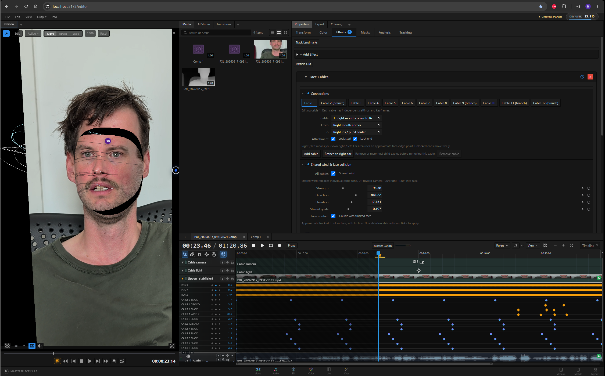
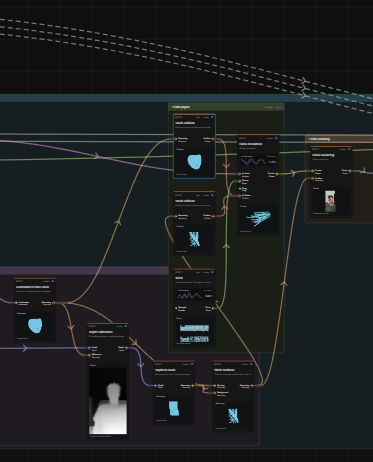
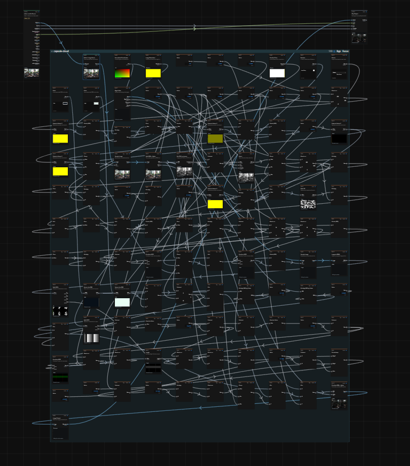

# MasterSelects

Preview GPU submissions are bounded so heavy scenes coalesce playback and scrub requests to the current playhead instead of building a queue of stale frames. Export and RAM-preview generation retain every requested frame.

Development automation can open an authorized project folder by disk path with
the confirmed `openLocalProject` bridge operation (Native Helper required).

A browser-based video editor and a workspace you can extend while you create.
Edit video, mix audio, animate graphics, build 3D scenes, and work with AI in one multitrack timeline. The editor runs on React, TypeScript, WebGPU, and WebCodecs.

On desktop Linux, Vulkan troubleshooting appears only when WebGPU initialization fails and clears after a successful initialization. See [Linux GPU troubleshooting](docs/Features/Linux-Mesa-GPU.md).

[Open the editor](https://www.masterselects.com/) · [Documentation](https://www.masterselects.com/docs/) · [Discord](https://discord.com/invite/K8dApzG3XC) · [Report an issue](https://github.com/Sportinger/MasterSelects/issues)



*Face Cables combines face tracking, animated controls, and optional scene depth. See the [feature guide](docs/Features/README.md) for this and other workflows.*

## What you can make

| Workspace | Highlights |
| --- | --- |
| **Video** | Multitrack editing, nested compositions, proxies, multicam, and Premiere Pro sequence import. Speed, reverse and freeze frames share one retime contract across preview, scrubbing, export and audio. |
| **Nodes** | Build and reuse effect, color, geometry, and 3D graphs with typed connections and live previews. Unconnected cards pack compactly, separately from expanded groups. Cables fade with overlapping group depth using cached coverage and reusable paths; obstacle routing prefers clear direct lanes and removes retraced segments. The composition graph shows media, tracks, transitions and beat rules as one graph, with one compact lane per clip under its track strip (source, range, speed, effects, target); each lane expands in place into its full processing graph. |
| **Color & effects** | Grade footage, combine GPU effects and transitions, and animate masks and properties. |
| **Audio** | Edit waveforms, mix tracks, record, apply effects, and separate stems. |
| **Motion & tracking** | Animate text and shapes, create captions, and attach graphics to tracked footage. |
| **3D** | Combine footage, models, lights, cameras, Gaussian splats, and particle effects. |
| **AI** | Ask the in-app agent to edit the timeline or generate media. Nodes and cables appear beside Preview as individual AI instructions arrive. AI Studio keeps Chat and Generation free of a floating credit banner. |

Waveform previews, pyramid analysis, and cache unpacking run in dedicated workers. Large timelines reuse saved source waveforms after refresh, share results across split clips, and limit background analysis updates. Decoding and waveform generation do not hold the project save barrier. See [Audio Intelligence](docs/Features/Audio-Intelligence.md).

Beat rules distribute selected clips on analyzed beats or the tempo map and keep manual corrections as offsets; the in-app agent can read the composition graph and edit these rules. See [Node Workspace](docs/Features/Node-Workspace.md#composition-workspace).

Timeline scrolling reuses prepared waveform columns and bounds dashed composition outlines to the visible canvas. Open composition tabs restore only their timeline, retain connected media, and remember independent playhead and zoom positions. See [Timeline](docs/Features/Timeline.md).

Large audio timelines prepare waveform columns within the canvas viewport and reuse source data across UI updates. Progressively loaded waveforms preserve the existing canvas display. Long WAV files decode without another complete encoded-audio copy on the UI thread. See [Audio](docs/Features/Audio.md).

Multicam camera tiles adapt their render resolution to the panel and reuse unchanged video frames. The main preview retains its selected quality and original source decoding. During scrubbing, the program camera shares the main preview's source while other cameras catch up on release. Playback clock updates stay local to the timeline's time display and playhead; inactive preview overlays do not subscribe to the running clock. See [Preview](docs/Features/Preview.md#multi-preview).

Canon CR2 photos import at full resolution through browser-local RAW development,
with the original files preserved. Source Monitor fits the complete photo and
provides Fit view to reset zoom and pan. Lens Correction includes a Canon EF
24–105 mm f/4L IS USM profile dropdown, CR2 exposure metadata, and manual
distortion, chromatic aberration, independently bypassable vignette controls,
and automatic framing to show the complete corrected photo. Guided Perspective
straightens photographed edges with up to eight guides per direction, edited
directly in Preview with zoom, pan and right-click removal.
AI Edge Fill then fills transparent borders on still images with an explicitly
started Kie.ai / Nano Banana Pro generation (1K, 2K or 4K), retaining original
opaque pixels and storing the fill in the project. See
[Media Panel](docs/Features/Media-Panel.md) and [Effects](docs/Features/Effects.md#lens-correction).

Linux/Mesa preview and output canvases use software presentation of the completed WebGPU image to prevent blank or transparent GPU surfaces. GPU rendering, including path tracing, remains active. See [Linux/Mesa constraints](docs/Features/Linux-Mesa-GPU.md).

### Node graphs

Clip control nodes now also drive the clip Transform (position, anchor, scale, rotation, opacity). New controls add Smooth Noise, attack/hold/decay Envelopes, Marker Triggers that time pulses to timeline markers, and a Two-Bone IK with individual angle and joint outputs for rigging Pick-Whip parented layers. See [Node Workspace](docs/Features/Node-Workspace.md#procedural-parameter-sources).

A **Stick Figure** effect draws a posable figure on any clip, best on the new transparent **Blank Clip**; its joints take keyframes, a pose library and control nodes. **Gait Cycle** walks, runs or idles it in one click, **Limb IK** plants feet and reaches hands, **Ballistic** throws and bounces, and **Attach to Joint** lets props follow a hand and fly on when released. The Simple Synth adds noise, a pitch envelope, filter types and SFX presets for the matching sound. Fights build fast from **action clips** (punch, kick, jump, throw, fall …) on a figure's lane: strikes can aim at another figure, contacts become markers, sounds or Contact Trigger pulses, and **Check choreography** (also the `validateChoreography` AI tool) finds misses, pops and feet in the ground. See [Node Workspace](docs/Features/Node-Workspace.md#stick-figures-and-rig-nodes).

Flock includes Terracotta and Lilac Sculpture presets: dense, low-gravity
APIC sheets with slow curl forces, spatial pigment colors and a lit gallery box.
They start calmly inside the box, with overlapping curl fields developing during playback.
Preview displays simulation preparation progress and loading activity for 3D models.

[Flock](docs/Features/Flock-Clips.md) point rendering adapts sub-particle density
to the scene target, scales screen point sizes from a 1080p reference, and uses
parent particles for shadows. Optional GPU timestamps expose simulation,
fluid-transfer, pressure, point-cache, shadow and drawing costs through `getStats`.
Small opaque points and bounded shadow footprints use compute rasterization,
with deterministic depth ties and a resolve into the shared 3D depth buffer.
APIC fluid transfers adapt their accumulation precision to local density and
velocity to avoid integer overflow in dense piles. They preserve local rotation
and shear with an affine matrix per
particle, using a stable GPU cell permutation and workgroup accumulation,
preserving particle identity across rendering, trails and checkpoints.
Checkpoint persistence remains valid when the GPU cache evicts a snapshot during readback.
Persistent precompute streams checkpoints to IndexedDB as they are produced;
capacity-dependent GPU budgets also apply to imported and shared snapshots.
The opt-in Worker render path groups Flock, primitive meshes and scene lights and loads their
image pigments, instance models and audio analysis in the Worker. Audio-driven
checkpoints distinguish analysis content and clip placement; export preparation pins
that identity across asynchronous work. Local development now starts with the strict
Worker GPU preview, including ordinary `/editor` reloads. Automatic main-renderer
fallback is disabled in this mode. An explicit development `?renderHost=main`
remains available for diagnostics; production startup is unchanged.
Playback health telemetry avoids synchronous GPU pixel reads, keeping those
readback stalls off the UI thread; unavailable pixel-health metrics are omitted.
Worker 3D rendering honors preview quality and retains resolution changes across
canvas registration. Small preview simulation batches leave GPU time for the UI.
Precompute, cancellation and cache clearing also run in the Worker, with progress
and optional persistent simulation checkpoints.
The Worker preview reports its own Flock simulation, memory and checkpoint status
to the inspector; nested occurrences remain separate in render-host diagnostics.
`getStats.flockGpu` identifies the active renderer and includes the Worker's own
GPU pass timestamps when supported. Worker devices request the adapter's buffer
limits for large simulations; timing readbacks stay asynchronous and bounded.
Worker frame diagnostics also separate simulation preparation, encoding and GPU
submission wait, and stay updated while playback queues subsequent frames.
The final Worker simulation block shares the compositor's GPU completion fence;
intermediate catch-up blocks remain bounded. Diagnostics distinguish CPU encoding,
completion waits and the GPU span between measured passes.
Long Worker seeks resume retained simulation progress with fresh frame deadlines;
newer requests take priority and stalled work is not retried indefinitely.
Fluid pressure uses a multigrid-preconditioned conjugate-gradient solver on both
CPU and GPU, with residual-based convergence and solid domain walls.
The fluid node exposes particle separation, spacing and deterministic position
jitter to reduce grid-aligned bands; separation bounds dense-neighborhood work
to 64 candidates per particle. It gathers neighbor positions once in cell order
using existing sort workspace, reducing GPU memory reads without changing the simulation.
Graphs without boid rules or neighbor links use tiny placeholder bindings instead
of allocating the full boid spatial index.
Simulation, neighbor sorting, trails and links distribute GPU work across two
dimensions; population increases remain subject to memory limits.

The node canvas automatically refits the full graph whenever nodes or connections are added or removed, including changes from internal and external AI agents. Deleting effects also closes the gap in the node chain, including after the last effect is removed. Agent clip selections preserve the visible panel instead of bringing Properties forward.

The **Compact** toggle wraps top-level effects into roughly square arrangements while preserving their internal node layout. Within flow-layout groups, loose and connected nodes share one origin to avoid oversized empty frames. **Avoid** routes cables around unrelated expanded effect groups as well as node cards, keeping existing routes visible while the layout and routing update. Angular cables between the same cards stay in a tight bundle, including during dragging, without diagonal Angular segments.

[Time Stack](docs/Features/Time-Stack.md) blends up to 32 delayed instances of a video in an editable node group, with shared source-frame sampling, all 37 timeline blend modes, and mouse-wheel control.

[Weave](docs/Features/Weave.md) builds woven fabric, yarns, ropes and knots from general curve nodes: threads are pulled in one by one, wobble like handmade cloth and billow on a simulated sheet, and simulated ropes collide, fall and pull knots tight. Strand Render draws them as lit fibers with Hashed, 4x Coverage or analytic tile-raster antialiasing and exchanges shadows with lit meshes. With [Path Tracing](docs/Features/Path-Tracing.md) the 3D scene renders physically: every fiber is ray traced with a hair BSDF, the preview adapts its moving resolution and refines a still image in small tiles from the center outward, with progress visible even within the first sample (ReSTIR, radiance cache, denoiser and upscaler). Export renders deterministic, denoised frames at the requested quality.

Development builds also offer an optional [native OptiX preview](tools/native-helper/optix/README.md) for fiber scenes. Its persistent CUDA/OptiX worker retains geometry, updates the camera with small packets and refines still images from the center outward. The separate comparison view reports WebGPU/native GPU, initialization and transfer timings. Native preview requires the matching helper; video export continues to use WebGPU.

Built-in Weave presets preserve the **Four-Yarn Knit Ring** study, **Endless Knit Band**, and the earlier **Wave Strands** graph as editable effects in Nodes → Effect presets. **Jellyfish — Video Reconstruction** approximates a recorded yarn sculpture: yarn circulates through a fixed knitting window while a localized pulse starts at the knitted head and travels through the long return loops at full strength. Tail Inset draws the resting return loops inward behind the domed head; reusable **Curl Noise** nodes send the loose loops into irregular swirls in all three axes. Two masked fields travel in opposite directions along the two sides, with independent shape evolution. Head Wobble adds gentle motion over the dome, while Tail Soft Noise gives individual yarns different smooth bends, with a rear transition that stays smooth during long playback. Return Length extends the free loops independently of the head. Body Length, Return Length, Tail Inset, Irregularity, Return Flow, Curl Strength, Curl Detail, Curl Evolution, Head Wobble, Tail Soft Noise, Soft Motion, Yarn Circulation, Pulse Rate and Pulse Strength are editable; the fields keep evolving while circulation and pulse repeat every 20 source seconds. Saved Curl Noise graphs retain their original input contract; unfinished Weave wiring reopens as an editable draft. Linux video export reads compositor pixels to avoid silently black GPU-canvas captures; opaque output preserves preview brightness for soft dust and thin yarn without applying coverage twice. These presets remain available without browser storage.

Knit Sphere's band height can gather all rings into one connected knitting patch. Preview camera orbit drags follow the pointer vertically as well as horizontally.
Curve Scan Labels add GPU-anchored tracking rings, leader lines and transparent 3D readout cards that float, search the full camera image for clearer space using a smoothed strand occupancy field and mutual spacing between visible cards, with softer lateral separation and limited depth retreat when crowded, and follow the animated camera with deterministic position and rotation lag. Staggered lifetimes draw cards and their connecting lines in and out in at most 500 ms. Mixed shapes, depth travel, brief bold flashes and occasional spatial window echoes vary the readouts; detached-strand alerts wait until the new target is acquired. Downstream image effects such as Glow are retained on generated strand layers in preview and export. Rings and leaders have independent thickness controls and an optional soft raster glow without a fullscreen blur. Optional diagonal glitch waves sweep only the readout windows every 12 seconds, followed by individual one-to-two-second recoveries.

Strand Render also accepts per-point RGB fields for gradients and alternating color bands with independent offsets per yarn.
Material-coordinate yarn colors retain GPU cloth and rod simulation; spatial color fields use the final CPU-deformed positions. Yarn Profile Surface Feed moves fiber detail along a curve without changing its centerline. Legacy parameter graphs remain isolated per effect.
Curve Contact separates overlapping yarn capsules after procedural deformation while preserving closed rings and their color coordinates.
Closed Curve Flow circulates yarn material along fixed stitch paths, independently of the shape animation. Rod Simulation supports per-node time scale and offset for paired entry and exit studies. Constant-speed pulling and the finite, baked Knit Passage Study support successive four-yarn draw-throughs on an upright ring, with a wider mature patch separating entry and exit; its entry is reverse playback and its return is constructed.
Experimental Knit Cycle Guides drive closed yarn bands through separate forming and release zones in one forward-time rod solve.
Close Curve adds a smooth return bow to each open yarn, creating closed ropes for Rod Simulation; geometric closure alone does not loop the motion.
Rod Simulation's Pull Direction field moves selected pins on open or closed ropes along fixed normalized directions; zero vectors hold supports still. Build and map the closed ring before the solve for coupled tension and contacts. This enables tension studies, not repeated needle-driven stitch formation.
Ordinary curve generators also run trailing Set Position and Yarn Profile fields on the GPU, reusing the existing Curl/Noise nodes. Preview keeps the last completed geometry while the next frame is prepared; export waits for exact geometry and bounds. Position-dependent material fields retain the CPU path. Paused camera navigation reuses unchanged solid textures instead of uploading them on every redraw.

Set Position after Rod Simulation deforms the result on the GPU, for example bending a stitch animation into a ring while preserving its original simulation.

[Slit Scan](docs/Features/Effects.md#slit-scan) starts with 3D geometry bypassed. It can match its time factor to the source frame rate and sample count, and optionally compensate motion between decoded frames in resident GPU history with adjustable flow strength.

Its [space-time slice](docs/Features/Slit-Scan-3D.md#space-time-slice-observed-depth) tilts and cuts baked color/depth observations from a fixed camera. A tracked 2D shape target can also solve a time field from an anchor and target stretch, with recorded-motion fit errors shown in the inspector.

| Detail view | Full graph |
| --- | --- |
| <a href="docs/images/node-graph-detail.png"></a> | <a href="docs/images/node-graph-overview.png"></a> |

Import video, audio, images, animations, 3D assets, and Premiere Pro projects. Export video, audio, still frames, and interchange formats. FAST export waits for the exact decoded source frame, including reordered frames that arrive after additional samples; multi-clip speed ramps prefetch at their animated source time. Browser, operating system, and GPU support affect available codecs and performance. See [media import](docs/Features/Media-Panel.md) and [export](docs/Features/Export.md).

The [Notebook](docs/Features/Documents.md) is a continuous writing surface for notes and screenplays. Passages can receive labels, scene ranges, comments and media links after writing; imported PDFs retain an original-page view.

## Build while you create

[Runtime diagnostics](docs/Features/Debugging.md) include version, build and source
commit identifiers so maintainers can trace reported failures to a release.

Dense [mask overlays](docs/Features/Masks.md) reuse contour transforms and interpolated paths during interaction. [Project recovery](docs/Features/Project-Persistence.md) retains recent entries when folder access fails. Development refreshes proceed without an unsaved-work browser prompt.

[Browser Roto](docs/Features/AI-Integration.md#browser-roto-sam-21) uses local SAM 2.1 video segmentation to select moving objects directly in Preview, watch tracking progress there, refine mask edges, and convert results into animated clip masks or export mask and transparent videos without the Native Helper. Roto masks and corrections survive panel and clip switches within the editor tab; converted clip masks are saved with the project.

I built MasterSelects because I wanted an editor I could shape around a project. When a tool is missing, a coding agent can add an effect, control, or workflow to the source; you can try it in the same project and contribute it for others to use.

The codebase includes [agent instructions](AGENTS.md), [feature documentation](docs/Features/README.md), reusable editor components, and an [authenticated local bridge](docs/Features/AI-Bridge-Control.md) for inspecting and operating the running editor. The hosted AI kernel is maintained separately from this repository.

## Try it

Open [masterselects.com](https://www.masterselects.com/), import a clip, and drag it onto the timeline. Press **Space** to play, **C** to cut, and **Ctrl/Cmd+S** to save. More controls are in the [keyboard shortcuts](docs/Features/Keyboard-Shortcuts.md).

Projects [save continuously](docs/Features/Project-Persistence.md), with durable branching history. **Ctrl/Cmd+S** waits for pending content, history navigation and workspace changes to reach storage; named versions are separate from Save.
Filesystem saves page through one bounded filename snapshot per fresh history-folder check, avoiding repeated physical scans as history grows.
Large redo-preference lists are stored in bounded blocks so long editing histories can continue saving without dropping remembered branches. Saves also keep a checked startup cache in the project folder; reopening reuses unchanged history and applies any newer edits automatically.

[Weave](docs/Features/Weave.md) supports fading Curve Contact corrections for selected animation intervals and evaluates final contacts after procedural fields on the GPU. Single-sample Raster exports show steady frame progress without a sample/denoise indicator. Raster strand layers keep their own projected image effects, including Glow on transparent backgrounds, and apply Transform blend modes within shared 3D scenes.

Chrome or Edge on desktop is a good starting point. Editing and rendering run locally in the browser; hosted AI and media generation use external services and may require credits. Local AI features may download models on first use. MasterSelects is under active development, so keep backups of important projects.

## Run locally

An [Android development app](docs/Features/Android-App.md) packages the editor for offline local editing, with Android project-folder selection, media import, export saving/sharing, and online cloud services. Android beta purchases are disabled; existing account credits remain usable. Project folders require Android 17; older Android versions use app-private storage. Build it from the final web build with `node scripts/android.mjs build`; device verification and store release are separate steps.

Install the Node.js version in [`.node-version`](.node-version), then run:

```bash
git clone https://github.com/Sportinger/MasterSelects.git
cd MasterSelects
npm ci
npm run dev
```

Open **http://localhost:5173**. Hosted login, credits, and AI services need the full development stack and separate service configuration. Maintainers with the private kernel checkout can use `npm run dev:full`.

External agents can connect to the local editor with `npm run mcp`; see [AI bridge control](docs/Features/AI-Bridge-Control.md) for setup and access boundaries.

## Contribute

Focused pull requests, reproducible bug reports, and documentation improvements are welcome. For larger features, open an issue first. Read [AGENTS.md](AGENTS.md) for repository conventions and use the [feature guide](docs/Features/README.md) to find the relevant architecture and workflows.

## License

MasterSelects is licensed under **AGPL-3.0-only**. Commercial use is permitted under its terms. Videos and other ordinary media made with the editor do not inherit its license. See [LICENSE](LICENSE), [LICENSING.md](LICENSING.md), and [third-party notices](THIRD_PARTY_NOTICES.md).

Linked clips selected together now share a contour outline in the timeline, following their outer edges instead of highlighting every clip individually.

Projects assume saved media locations are available and open sources only when needed for preview, playback, editing or export. Unused media are not scanned on reload; only failed source access requests relinking. See [project persistence](docs/Features/Project-Repository.md).

Camera **Continuous / Orbit** keyframes retain the actual Preview Orbit pivot, including off-centre objects and off-axis framing. Saved projects and copied camera keys preserve it; **Shortest Path** restores the direct move. See [camera rotation paths](docs/Features/Keyframes.md#rotation-path).

Exposed values in editable effect graphs participate in property search and keyframe authoring, including their per-instance labels and slider ranges. See [Weave](docs/Features/Weave.md).

Weave supports larger multi-stage formation graphs: reusable compositions respect the geometry graph budget, while per-point shader instruction limits remain separate.
Repeated pure geometry expressions share shader work within a stage, allowing reused motion graphs without duplicating identical samples.

Export uses Raster by default; Render Quality can opt into Path Traced or follow the composition.

Raster 3D cameras support depth-buffer-based focus blur and a Physical Camera bypass. Flock particles include Gaussian
softness, stable opacity variation and inexpensive velocity streaks; their Transform blend
mode and opacity composite against the shared scene.

Keyframe curve drags coalesce pointer updates; bulk easing edits publish once and preserve unrelated keyframe data. Clip/keyframe drag previews defer project encoding until release, and editing existing keyframe values retains their easing.

Weave circulation supports an independent integrated Motion Time clock for smooth starts and stops, with an optional matching minimum speed at both loop endpoints; see [Weave](docs/Features/Weave.md#independent-eased-circulation).

Curve Scan Labels supports independently randomized appearances, shared intro/outro cue timing, tracking hold intervals, 6–20-copy echo trails and smooth window rotations up to 45 degrees that return to camera-parallel rest. Optional brief corner locks show an animated padlock and fast priority ticker before releasing the card back into space; timed lower-side stacks can hold up to three differently sized cards per side without overlapping their reserved footprints, with optional per-card docking/release delays and separate early lock slots. A dev-only visible-material map identifies strand indices and moving material coordinates directly from depth-tested GPU fibers; its compact tracking mode also exposes the actual GPU target-acquisition state for diagnostic and sound-cue alignment.

Scan-window glitch waves include emissive fragments, warped outlines and text sizes, and curved connection lines with fixed endpoints. Intro readouts face the camera with brief multilingual decoding; optional bold red warning groups accumulate only after released-strand targets are acquired.

Weave Motion Time also provides a normalized forward loop phase for eased cyclic material motion without an end-of-shot rewind.

Scan overlays use a slower three-second diagonal glitch front with reduced spatial width and separate per-card aftershocks.

Weave’s Final Stillness control can leave only tiny residual circulation in the last seconds. An optional integrated direction turn can reverse circulation smoothly while the separate loop phase keeps its forward closure.

Curve Scan Labels supports exact material anchors and amber opening rings that respect randomized card order and appear with their cards.

Scan intros combine detailed readouts with cream multilingual text on independently moving 3D planes, progressively decode characters, switch languages briefly, then return to normal readouts.

Weave scan cards support material anchors for an authored tracking hold, with projected card bounds kept in frame while the yarn moves.
