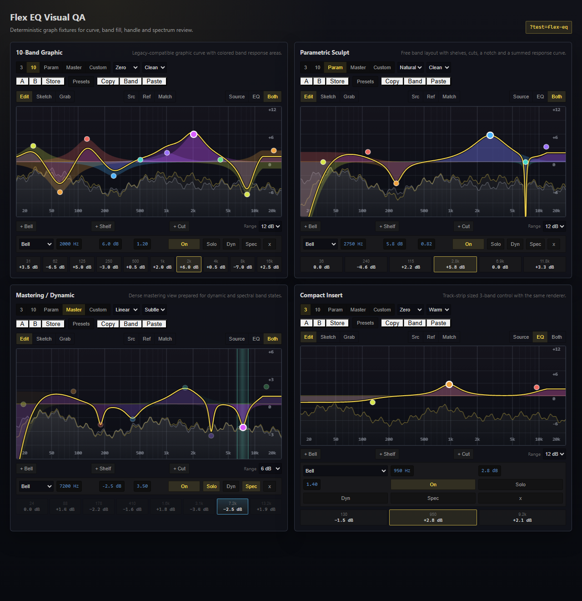

# Flex EQ Visual QA

[Back to Index](./README.md)

The deterministic QA route for the flexible equalizer is available in the dev server at:

```text
http://127.0.0.1:5173/?test=flex-eq
```

It renders seeded fixtures for 10-band graphic EQ, free parametric curves, dense mastering curves with dynamic/spectral metadata, the preset browser surface, Sketch/Grab/Match controls, Band Solo state, Spectral Dynamics graph overlays, and a compact track-insert layout. The route does not depend on project state.

## Documentation Image



The image above is generated from `docs/Features/assets/docs-screenshot-manifest.json`.
Run the dev server first, then regenerate it with:

```powershell
npm run docs:screenshots -- --id=flex-eq-visual-qa
```

The runner uses installed Edge/Chrome/Chromium in headless mode. To override the browser or dev server:

```powershell
$env:DOCS_SCREENSHOT_BROWSER = 'C:\Program Files (x86)\Microsoft\Edge\Application\msedge.exe'
npm run docs:screenshots -- --base-url=http://127.0.0.1:5173 --id=flex-eq-visual-qa
```

Use a taller `window.height` in the manifest entry when checking the full fixture grid including compact controls.
