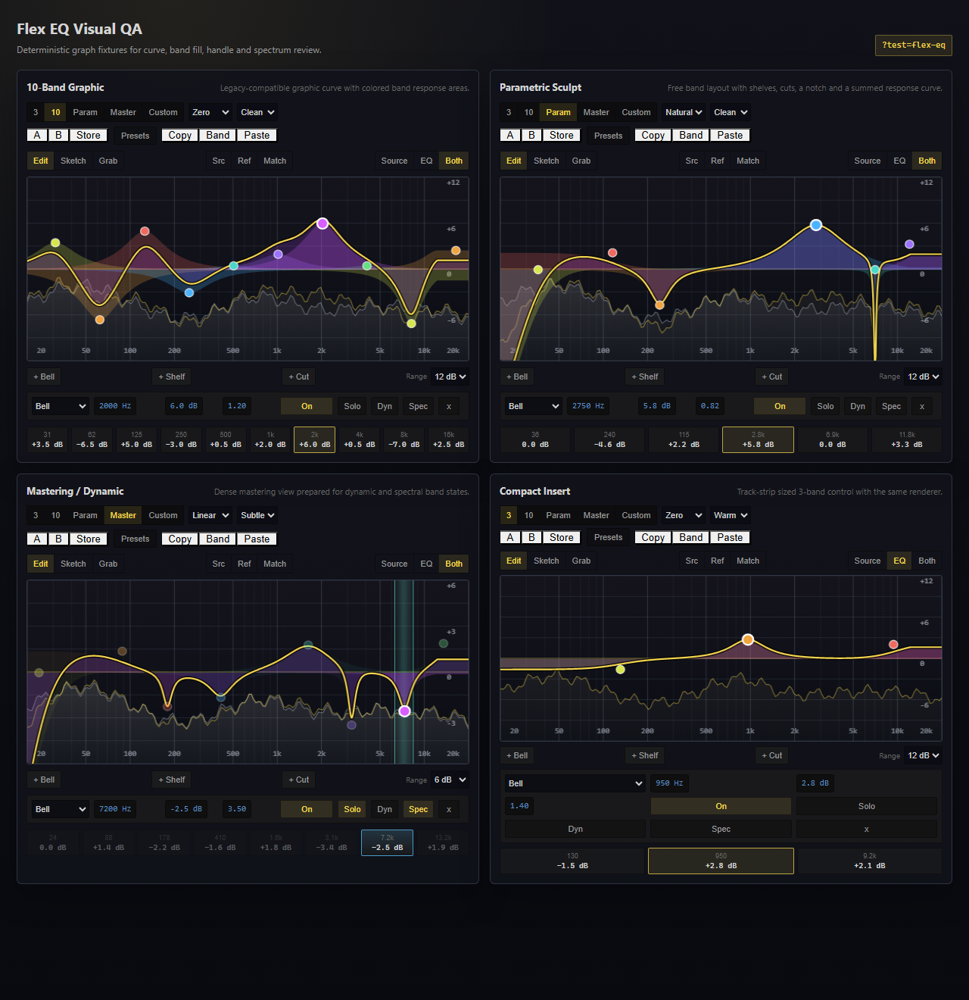

# Flex EQ Visual QA

[Back to Index](./README.md)

The deterministic QA route for the flexible equalizer is available in the dev server at:

```text
http://127.0.0.1:5173/?test=flex-eq
```

It renders four seeded fixtures: 10-band graphic EQ, free parametric curves, a dense mastering curve with active dynamic and spectral-dynamics band state, and a compact insert layout. The grid shows Sketch, Grab, Match, Band Solo, and Spectral Dynamics graph overlays; the preset browser is available through the **Presets** control rather than open by default. It also includes shipped band add/delete/enable controls, phase and character modes, A/B store/switch, clipboard actions, and selectable spectrum views.

The route owns its fixture parameters locally and does not read project state. Its preset browser can load browser-local user presets and favorites.

## Documentation Image



The screenshot source is `docs/Features/assets/docs-screenshot-manifest.json`.
Run the dev server first, then regenerate it with:

```powershell
npm run docs:screenshots -- --id=flex-eq-visual-qa
```

The runner uses installed Edge/Chrome/Chromium in headless mode. To override the browser or dev server:

```powershell
$env:DOCS_SCREENSHOT_BROWSER = 'C:\Program Files (x86)\Microsoft\Edge\Application\msedge.exe'
npm run docs:screenshots -- --base-url=http://127.0.0.1:5173 --id=flex-eq-visual-qa
```

The manifest uses a 1280x1320 viewport, which captures the full four-card fixture grid including compact controls.
