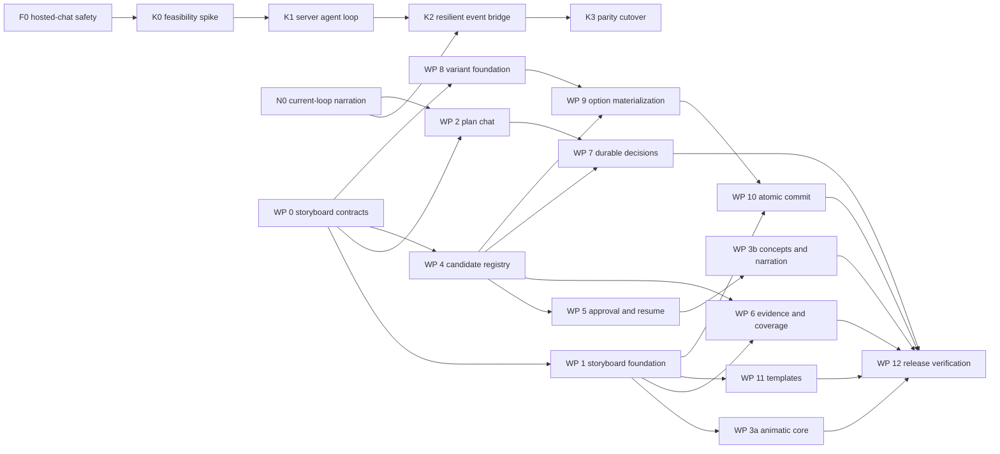

# AI Storyboard, Plan Mode, and Timeline Variants

Status: implementation complete — Storyboard G5 release-verified; Kernel Lite production canary pending external evidence (2026-07-30)<br>
Scope: public MasterSelects client. Kernel-side planning, prompting, and
candidate-ranking logic lives in the private kernel repository. This document
defines the client UX, persisted state, safety rules, and the public wire
contract the kernel may rely on.

## 1. Vision

The storyboard is not only a pre-cut outline for existing footage. It is the
directing surface for a video that may combine:

- existing source material;
- AI-generated stills and video;
- voice, music, and sound generation;
- conventional edits, effects, and transitions.

Each scene starts as a readable card on the real timeline. The card states what
the scene must achieve, what it should look and sound like, what evidence or
references support it, and how long it should be. It can later collect source
moments, visual concepts, generated video candidates, and accepted timeline
clips without losing the original intent.

The chat pill gains a Plan mode. In Plan mode the AI discusses and changes the
storyboard, but cannot silently edit real media or spend generation credits. A
separate decision policy controls how autonomous execution is:

- **Plan**: discuss structure, create/update scene cards, prompts, and briefs.
- **Co-direct**: build alternatives and pause at decisions so the user can
  compare, choose, combine, or request more options.
- **Execute**: use the existing verified edit path for actions the user has
  approved.

The defining interaction is:

> Mark a timeline range, say “I do not like this part; make three options,” and
> receive three range-scoped timeline variants. Scrub or play them, compare
> their reasoning and cost, choose one (or combine them), and apply the result
> to the main timeline as one undoable edit.

The full loop is:

**talk → storyboard → gather/generate candidates → compare variants → decide →
commit → verify**

The storyboard remains the durable contract throughout. It does not disappear
when the first media is generated or the first cut is accepted.

## 2. Architecture anchor points (as-is)

The current client already has most of the primitives, but they are not yet
connected as one directing workflow.

### 2.1 Chat and kernel execution

- Chat pill:
  `src/components/panels/flashboard/useFlashBoardChatController.ts` →
  `sendFlashBoardChatMessage` in
  `src/services/flashboard/FlashBoardChatService.ts`.
- Kernel-first cutover:
  `src/services/kernelClient/kernelChatGateway.ts`.
- The current verified path is compile → execute `resolvedCalls` through
  `executeAIToolCalls` inside an agent transaction → `/complete` fingerprint
  verification.
- The compile contract in `src/services/kernelClient/types.ts` currently
  supports mechanical/story execution and abort/failure responses. Planning,
  decisions, generation intents, and range variants need explicit response
  variants; they must not be disguised as ordinary synchronous tool calls.
- The direct Kie.ai/Local AI path already supports repeated model → tool →
  result rounds, but the pending chat bubble normally shows only a generic
  “AI thinking…” label. Assistant text produced alongside intermediate tool
  calls is not yet surfaced as an ongoing, narrated work log.

### 2.2 Timeline selection and editing

- `TimelineClip` lives in `src/types/timeline.ts`; `TimelineSourceType` is in
  `src/types/timelineSource.ts`.
- Text and solid clips are precedents for file-less, freely trimmable sources
  (`src/components/timeline/utils/clipSourceTiming.ts`).
- A real range-selection model already exists:
  `TimelineRangeSelection { startTime, endTime, trackIds, anchorTrackId? }` in
  `src/stores/timeline/storeTypes/toolTypes.ts`.
- The visual overlay and store action already exist, but
  `handleGetTimelineState` currently exposes clip selection and in/out points,
  not `timelineRangeSelection`. The kernel therefore cannot yet address the
  exact range and track scope the user painted.
- Edit operations already support range work, batching, linked-clip policies,
  keyframes, transitions, and undo. A variant commit should use those
  primitives rather than mutate arrays directly.

### 2.3 AI generation

- FlashBoard already has a persisted asynchronous job model:
  `FlashBoardActiveGenerationRecord`, `FlashBoardGenerationOutput`, and
  `FlashBoardResult` in `src/stores/flashboardStore/types.ts`.
- `FlashBoardJobService.ts` owns provider submission, polling/resume,
  cancellation, and reference-media resolution.
- `FlashBoardMediaBridge.ts` downloads completed output, imports it as a
  project-local file under `AI Gen / Video`, `Images`, or `Audio`, writes
  generation metadata, and returns stable `mediaFileId` values.
- Generated results can already be dragged or inserted into the timeline.
- The missing piece is a stable association from a storyboard scene or variant
  option to its generation record, output, imported media, prompt revision,
  and decision state.

### 2.4 Compositions and history

- `duplicateComposition` already produces a timeline clone, and composition
  tabs can display alternatives.
- Current duplication deliberately strips transition-composition IDs. A
  production variant clone therefore needs its own clone/remap path if
  editable transition subcompositions must survive.
- The History panel already visualizes branches. Those branches are global
  project snapshots created when a redo path is abandoned. They are a useful
  safety net, but not the primary variant model:
  - they include unrelated project/media/FlashBoard state;
  - they cannot naturally show three alternatives at once;
  - they are not explicitly range- or track-scoped;
  - switching branches changes the whole project.

The recommended v1 implementation materializes options as temporary
compositions for playback while retaining an explicit range-scoped
`TimelineVariantSet` as the canonical comparison object.

### 2.5 Parallel infrastructure track: hosted agent loop without the harness

The hosted-agent migration is a separate infrastructure track, not a
prerequisite for storyboard work or model-authored progress narration. First
ship narration on the current loop and repair the current hosted-chat safety
gaps. Then evaluate moving the normal AI loop into the kernel as faithfully as
possible.

Today, hosted Kie.ai model rounds already pass through `/api/ai/chat`, but the
MasterSelects client owns the repeated model → tool → result loop. The first
kernel milestone moves that orchestration loop and its conversation state to
the server while leaving the actual semantic tool execution in the editor.
This is a relocation of the existing agent, not yet a compile/verify redesign.

```text
MasterSelects client
  → start/resume agent turn
Kernel hosted-agent runtime
  → call the selected Kie.ai model
  → stream model narration and request a semantic editor tool
MasterSelects client
  → execute the existing local tool and return its result
Kernel hosted-agent runtime
  → continue the same model turn until final response
```

The first hosted-agent release deliberately does **not** require:

- a compile response;
- `resolvedCalls` prepared up front;
- an agent timeline transaction around the complete turn;
- expected/final fingerprint comparison;
- a kernel `/complete` verification call.

Its parity target is the behavior users already like:

- the same model IDs, reasoning effort, temperature rules, prompt version,
  task playbooks, tool schemas, output limits, and iteration guard;
- iterative inspection, editing, correction, and verification;
- model-authored commentary between meaningful tool rounds;
- current generation approval, undo behavior, and enforced tool-execution
  policy;
- the existing chat history and tool-result continuity.

Do not claim parity for behavior that does not yet exist. In the current code,
`requiresConfirmation` is metadata but is not enforced, and the hosted request
path does not propagate `AbortSignal` or check it between provider rounds.
Cancellation, a maximum chat-turn spend, and any generalized confirmation gate
are prerequisite safety work, not behaviors the migration can merely preserve.

The editor remains the authority for live project state. The kernel never
mutates a browser timeline directly; it requests a versioned semantic tool and
waits for the exact client result. The later verified harness remains valuable
for Plan mode, isolated variants, high-risk commits, and fingerprint-sensitive
work, but it is layered on after hosted-agent parity rather than blocking the
normal chat migration.

Keep these routes available during rollout:

- `hosted-agent`: the kernel owns the Kie.ai agent loop; the editor executes
  tools;
- `legacy-direct`: the current client-owned loop, retained behind a feature
  flag for rollback. In production today, authenticated users with hosted AI
  access are routed hosted even when a BYO key is configured; changing that
  requires an explicit product routing control rather than a parity claim;
- `local`: Lemonade/Local AI stays client-owned because a remote kernel cannot
  normally reach the user's local model;
- `verified`: the later compile → execute → `/complete` harness.

#### 2.5.1 Current server-platform constraints

The existing kernel proxy at `functions/api/kernel/[[path]].ts` cannot carry
the proposed hosted-agent stream unchanged:

- its allowlist contains only `health`, `compile`, and
  `runs/:id/complete`;
- it forwards a new header set rather than `Last-Event-ID` and the required
  session metadata;
- it rewrites every upstream response as `application/json`;
- it aborts the upstream connection after 240 seconds;
- `/api/ai/chat` currently advertises `streamSupported: false` and rejects
  streaming requests.

K0 is therefore a feasibility spike, not an immediate protocol freeze. It must
choose and prove one of these transports:

1. extend the Cloudflare kernel proxy to allowlist hosted-agent routes,
   preserve streaming headers/content type, forward reconnect metadata, and
   support bounded reconnectable event streams; or
2. introduce a separate authenticated hosted-agent origin with an equally
   explicit user-identity, billing, CORS, and rollback boundary.

Round-level narration events are sufficient for v1. Token-level provider
streaming is optional and must not block narration on the current client loop.

#### 2.5.2 Safety repairs before K0

Ship these fixes on the existing hosted path whether or not Kernel Lite
proceeds:

- pass `request.signal` into hosted
  `cloudAiService.createChatCompletion` calls;
- check `request.signal.aborted` before each provider round and before local
  tool execution;
- enforce a server-authoritative maximum chat-turn spend and recheck remaining
  credit before continuation rounds;
- make billing settlement atomic or compensate safely when a conditional turn
  advance loses a race;
- redact system prompts, unrestricted tool results, transcript payloads, and
  base64 visual data from chat/audit persistence;
- expose model-authored intermediate text on the current Kie.ai and Local AI
  loops as its own independently releasable work package.

#### 2.5.3 Unverified private-kernel assumptions

The public repository cannot prove that the private kernel:

- runs as a stateful process suitable for long-lived or replayable sessions;
- has any user, credit, or hosted-chat billing concept;
- can access Kie.ai through the current hosted credential boundary;
- has a protected short-TTL session/event store;
- can accept the exact current prompt/history/tool surface without behavior
  drift;
- has comparable network latency to Kie.ai.

Treat each item as a K0 question, not an architectural fact. Failure to prove
identity/billing authority, ordered transport, or cancellation/spend control is
a no-go for Kernel Lite, not a reason to delay N0 or WP 0–12.

## 3. Product model

### 3.1 Two independent controls

Do not overload one toggle with two meanings.

```ts
type ChatIntent = 'plan' | 'execute';
type DecisionPolicy = 'automatic' | 'milestones' | 'every-decision';
```

- The existing requested **Plan** chip controls `ChatIntent`.
- A small adjacent policy control (labelled e.g. “Co-direct”) controls how
  often the AI must pause.
- Recommended default:
  - `intent: 'plan'`;
  - `decisionPolicy: 'milestones'`.
- Turning Plan off does not imply permission to spend credits. Generation
  approval remains a separate explicit gate.

This supports:

- planning without touching media;
- automatic low-risk edits but manual generation approval;
- step-by-step direction during both source-based cutting and AI generation;
- the existing direct edit behavior for users who want it.

### 3.2 What counts as a decision

The kernel may pause for:

- story structure (remove/add/reorder a beat);
- choice of source evidence or interview moment;
- cut rhythm or scene order;
- generated-video prompt direction;
- model/provider capability and estimated spend;
- visual continuity reference;
- duration mismatch policy;
- selection among timeline variants;
- replacing an accepted scene with a new candidate.

A decision is durable. It has an ID, question, options, explanation, state, and
the exact base snapshot/fingerprint it was made against. The chat may render
it as choice cards, but the record must survive panel close and project reload.

### 3.3 Scene lifecycle

Recommended scene statuses:

```ts
type StoryboardSceneStatus =
  | 'draft'
  | 'ready'
  | 'gathering'
  | 'generating'
  | 'review'
  | 'accepted'
  | 'filled'
  | 'blocked';
```

- `draft`: the idea is incomplete.
- `ready`: intent, duration, and direction are sufficient to search/generate.
- `gathering`: source evidence or references are being collected.
- `generating`: one or more external jobs are active.
- `review`: candidates exist and need a choice.
- `accepted`: a candidate or edit option has been selected.
- `filled`: accepted media is committed to the main timeline.
- `blocked`: required evidence, reference, provider capability, or approval is
  missing.

The status is derived where possible. A canceled job should not leave a scene
permanently in `generating`.

### 3.4 Model-narrated activity stream

The chat must expose the agent's work in natural language while it is happening,
similar to an interactive coding agent. This is not a list of deterministic
labels such as “running tool” and it is not raw hidden chain-of-thought. It is
short, model-authored commentary tied to observable work:

> I am checking the selected range and its linked audio first. There are two
> cuts near the scene boundary, so I need to preserve those handles before I
> build the alternatives.

> I found three usable interview moments, but only one has a clean visual
> entrance. I am using that as the conservative option and testing generated
> B-roll for the other two.

The direct provider loop should surface assistant text blocks from every model
round even when that same round also contains tool calls. Kernel progress,
direct Kie.ai rounds, and Local AI rounds normalize into one UI event model:

```ts
type AgentActivityEvent =
  | {
      id: string;
      runId: string;
      kind: 'narration';
      source: 'model';
      phase: 'inspecting' | 'planning' | 'acting' | 'verifying';
      roundIndex: number;
      text: string;
      createdAt: number;
    }
  | {
      id: string;
      runId: string;
      kind: 'operation';
      source: 'runtime';
      phase: 'started' | 'completed' | 'failed';
      safeLabel: string;
      toolName?: string;
      createdAt: number;
    }
  | {
      id: string;
      runId: string;
      kind: 'progress';
      source: 'runtime';
      label: string;
      current?: number;
      total?: number;
      createdAt: number;
    };
```

Interaction rules:

- the system prompt asks for a concise natural-language update before a
  meaningful tool batch, after an important finding, when the approach
  changes, and before verification;
- narration explains intent, evidence, and the next visible action, but never
  exposes hidden reasoning tokens, secrets, system prompts, or raw tool
  payloads;
- model narration is visibly paired with runtime events. Tool results remain
  authoritative if a model prediction and actual execution disagree;
- do not force a message before every small tool call. One useful paragraph
  per meaningful phase is preferable to repetitive noise;
- show narration immediately when its provider round completes. Use token
  streaming when the selected route supports it, but do not block v1 on
  token-level streaming;
- if a model emits no useful narration, show a compact runtime-derived status
  as a fallback. Deterministic labels are the fallback, not the primary
  experience;
- Plan, Co-direct, and Execute all use the same activity surface. Plan mode
  narration must not imply that real media changed;
- narration and safe operation summaries may persist with the chat run so the
  user can reopen the panel and understand what happened. Raw tool results,
  images, prompts, and secrets do not enter this activity journal;
- while a run is active, the latest narration stays visible with an expandable
  chronological work log below it. After completion, it collapses to a short
  summary while remaining inspectable;
- updates use a throttled `aria-live` region. Screen readers receive phase
  changes and decisions, not every token or rapidly repeated progress tick.

## 4. Persisted data model

The visible card stays a normal `TimelineClip`, but AI candidates and variants
should not be duplicated into every clip copy. Use a small clip-local
projection plus normalized project state.

### 4.1 Storyboard clip

New file `src/types/storyboard.ts`:

```ts
export interface StoryboardClipProperties {
  schemaVersion: 1;
  planId: string;
  sceneId: string;                    // stable identity, separate from clip.id
  title: string;                      // bold card title
  description: string;                // readable story/action description
  intent?: string;                    // what this scene must accomplish
  visualDirection?: string;
  audioDirection?: string;
  transitionIntent?: string;
  sceneKind?: string;                 // hook, interview, b-roll, CTA, etc.
  beatId?: string;
  color?: string;
  targetDurationSeconds: number;
  status: StoryboardSceneStatus;
  generationBriefId?: string;
  selectedCandidateId?: string;
  filledClipIds?: string[];
  evidenceRefIds?: string[];
  variantSetIds?: string[];
  notes?: string;
}
```

- `TimelineSourceType` gains `'storyboard'`.
- `TimelineClip` gains
  `storyboardProperties?: StoryboardClipProperties`.
- `sceneId` remains stable if a card receives a new clip ID during copy or
  repair. Scene cards should not normally be split; if the user splits one,
  the new right-hand scene receives a new `sceneId`.
- `'storyboard'` joins the infinite-source set so cards trim/extend freely.
- Clip duration is the live planned duration. `targetDurationSeconds` records
  the explicit intent so target-vs-actual reporting is not lost after filling.

### 4.2 Normalized storyboard project state

Add `storyboardStore` (or an equivalent slice in a project-content store):

```ts
export interface StoryboardProjectState {
  plans: Record<string, StoryboardPlan>;
  generationBriefs: Record<string, StoryboardGenerationBrief>;
  candidates: Record<string, StoryboardCandidate>;
  variantSets: Record<string, TimelineVariantSet>;
  decisions: Record<string, StoryboardDecision>;
  templates: Record<string, StoryboardTemplate>;
}
```

This state is project content:

- include it in project save/load and migrations;
- include it in history snapshots where an undoable edit changes it;
- fingerprint the relevant plan/scene/variant subset during verified work;
- do not store blobs or remote provider URLs in it;
- reference existing `mediaFileId`, generation record ID, and moment handles.

Keeping all of this on the clip would make option compositions duplicate job
state, decisions, and candidates. Keeping only IDs on the card lets every
variant refer to the same generated assets and reasoning.

### 4.3 Generation brief

```ts
export interface StoryboardGenerationBrief {
  id: string;
  sceneId: string;
  revision: number;
  prompt: string;
  negativePrompt?: string;
  visualContinuity?: string;
  camera?: string;
  motion?: string;
  lighting?: string;
  audioIntent?: string;
  durationSeconds: number;
  aspectRatio: string;
  referenceMediaFileIds: string[];
  startFrameMediaFileId?: string;
  endFrameMediaFileId?: string;
  capabilityPolicy: {
    mediaType: 'image' | 'video' | 'audio';
    needsImageToVideo?: boolean;
    needsStartEndFrames?: boolean;
    needsNativeAudio?: boolean;
    preferredQuality?: 'draft' | 'balanced' | 'final';
  };
  createdAt: number;
}
```

The kernel writes the creative brief and capability needs, not a hard-coded
provider ID. The client resolves those needs against the current FlashBoard
catalog, availability, user keys, pricing, and preferences. The user can still
lock a provider/model in the UI; that lock is recorded separately in the
prepared generation request.

Every candidate points to the exact brief revision that produced it. Editing
the scene does not rewrite the provenance of existing candidates.

### 4.4 Candidate

```ts
export interface StoryboardCandidate {
  id: string;
  sceneId: string;
  kind:
    | 'source-cut'
    | 'generated-image'
    | 'generated-video'
    | 'generated-audio'
    | 'hybrid';
  state:
    | 'proposed'
    | 'awaiting-approval'
    | 'queued'
    | 'processing'
    | 'ready'
    | 'rejected'
    | 'accepted'
    | 'failed'
    | 'canceled';
  generationBriefRevision?: number;
  generationRequestKey?: string;
  generationRecordId?: string;
  outputId?: string;
  mediaFileId?: string;
  sourceMomentHandles?: string[];
  variantSetId?: string;
  variantOptionId?: string;
  durationSeconds?: number;
  estimatedCredits?: number;
  actualCredits?: number;
  rationale?: string;
  createdAt: number;
}
```

`generationRequestKey` is client-created and idempotent. Retrying after a
transport failure must not submit the same paid job twice.

### 4.5 Evidence and coverage

Evidence references are versioned pointers, not copied transcript prose:

```ts
type StoryboardEvidenceRef =
  | { kind: 'transcript-moment'; handle: string; indexVersion: string }
  | { kind: 'source-range'; mediaFileId: string; start: number; end: number }
  | { kind: 'generated-candidate'; candidateId: string }
  | { kind: 'reference-image'; mediaFileId: string };

interface StoryboardCoverage {
  level: 'red' | 'yellow' | 'green';
  sourceScore: number;
  generationReadinessScore: number;
  reasons: string[];
  evaluatedAgainstFingerprint: string;
  evaluatedAt: number;
}
```

The UI must explain the color. “Yellow: two plausible transcript moments, but
no clean establishing shot” is useful; an unexplained yellow dot is not.

Source coverage and generation readiness stay separate internally:

- source coverage asks whether existing material can fulfill the scene;
- generation readiness asks whether the prompt, references, provider
  capability, duration, and approval are sufficient;
- overall color is a presentation summary, not the only stored result.

## 5. Timeline card and storyboard editing

### 5.1 Card rendering

Render in both the timeline worker painter and main-thread fallback:

- tinted card background and border;
- bold, larger title;
- wrapped description below the title;
- optional thumbnail strip when a visual storyboard image exists;
- status glyph and candidate count;
- coverage color and target/actual badge;
- narrow-card degradation:
  - full card at normal width;
  - title plus status below approximately 90 px;
  - only color/status below the existing minimum label width.

Storyboard joins `hasBodyPreview` in the chrome overlay so the normal
label/icon layer is not drawn over its own text.

Text layout should be cached by:

`(title, description, width, height, devicePixelRatio, font settings)`

This avoids re-wrapping every long card on every paint.

### 5.2 Editing

- Context menu: **Add scene card**.
- Double-click title: reuse
  `TimelineCanvasClipRenameInput.tsx`.
- Properties:
  - title and description;
  - scene kind / beat;
  - visual and audio direction;
  - transition intent;
  - target duration;
  - coverage explanation;
  - evidence and candidates;
  - generation brief and revision history.
- Drag, trim, snap, ripple, multi-select, and undo remain normal timeline
  operations.
- Scene reorder/retime in Plan mode edits only cards.

### 5.3 Target vs. actual badge

Once a scene has committed media:

- target = the explicit planned duration;
- actual = the union of accepted `filledClipIds` inside the scene scope;
- badge examples: `12 s / 10 s`, `+2.0 s`, or `−15%`;
- green within a small tolerance, yellow for a meaningful drift, red only when
  the drift violates a declared format/template constraint;
- click the badge to show where the duration changed and offer:
  - retime the edit;
  - update the plan;
  - leave the discrepancy as an accepted exception.

This must not assume that any deviation is an error.

## 6. Visual storyboard and animatic

### 6.1 Visual storyboard

Each scene may request a low-cost concept image before video generation.

Workflow:

1. Derive an image brief from the scene’s current generation brief.
2. Show prompt, references, model, and estimated cost before submission.
3. Import the result through `FlashBoardMediaBridge`.
4. Attach the resulting candidate to the scene and show it on the card.
5. Let the user explicitly promote it to:
   - visual reference only;
   - start frame for image-to-video;
   - end frame;
   - both a card thumbnail and a generation reference.

A concept image must not silently become an image-to-video start frame; that
changes creative intent and provider cost.

### 6.2 Animatic

Program-monitor priority for a storyboard scene:

1. accepted generated/source video candidate;
2. selected visual storyboard image with a simple configurable camera move;
3. scene slate (title, description, target duration, status).

Optional animatic narration:

- use the existing ElevenLabs path to read scene narration or description;
- create a dedicated temporary/persisted animatic narration track;
- show narration duration against target scene duration;
- offer “fit scene to narration” and “rewrite narration to fit,” never silently
  retime the plan;
- use scene audio direction to add temp music/SFX notes without pretending they
  are final sound design.

Export behavior should be explicit:

- **Animatic export** includes slates, visual concepts, temp narration, and
  optional watermarks/status.
- **Normal video export** warns about visible unfilled storyboard scenes and
  never silently ships a slate as final footage.

## 7. AI-generated video workflow

### 7.1 Prepare before spending

Planning and generation submission are separate phases.

1. Kernel/client creates or revises a `StoryboardGenerationBrief`.
2. Client resolves compatible current models and displays:
   - provider/model;
   - duration and resolution;
   - reference inputs;
   - number of candidates;
   - estimated credits and maximum possible spend.
3. User approves the batch.
4. Client creates candidate records and submits jobs with idempotency keys.
5. Existing FlashBoard queue runs them asynchronously.
6. Existing media bridge imports completed results and yields `mediaFileId`.
7. Candidate records move to `ready`; the scene moves to `review`.

No fallback provider and no kernel response may silently start a paid
generation.

### 7.2 Transaction boundary

Remote generation cannot be rolled back like a timeline edit.

- Writing a brief, preparing candidate records, or attaching completed output
  can participate in normal history.
- Provider submission happens outside the agent timeline transaction.
- Undoing a local record does not refund an already submitted job.
- Cancellation is best effort; the UI must distinguish:
  - canceled before provider submission;
  - cancel requested while processing;
  - completed and therefore billable.
- If a candidate is rejected or an option discarded, its imported media stays
  in the Media Pool until the user explicitly deletes it.

The existing kernel fingerprint verification remains useful for timeline and
storyboard state, but it must not claim that an external provider side effect
was rolled back.

### 7.3 Continuity across scenes

The plan needs explicit continuity controls:

- continuity groups for recurring character/location/style;
- reference-image locks;
- previous accepted scene as optional start/reference input;
- aspect-ratio and visual-style constraints inherited from the plan/template;
- per-scene override with a visible break-in-continuity warning;
- prompt revision lineage when the user says “like option B, but less camera
  motion.”

Generated assets are candidates, not automatically final. The user can:

- accept one;
- reject all;
- ask for more like one candidate;
- combine a generated establishing shot with a source-based dialogue cut;
- keep one only as a reference for the next generation.

### 7.4 Duration mismatch

Provider durations are often discrete. If generated output does not match the
planned range, create a decision with explicit strategies:

- trim the generation;
- change scene target duration and ripple later storyboard cards;
- retime within a safe bound;
- cover the gap with another shot;
- regenerate at a compatible duration;
- hold/loop only when visually appropriate.

The selected strategy becomes part of the variant rationale and target/actual
record.

## 8. Step-by-step co-direct mode

### 8.1 Decision cards in chat

The kernel may return a durable `awaiting-decision` response:

```ts
interface KernelDecisionResponse {
  runId: string;
  status: 'awaiting-decision';
  message: string;
  decision: {
    id: string;
    kind:
      | 'story'
      | 'evidence'
      | 'generation'
      | 'cut'
      | 'variant'
      | 'duration';
    question: string;
    baseFingerprint: unknown;
    options: Array<{
      id: string;
      title: string;
      summary: string;
      rationale?: string;
      tradeoffs?: string[];
      estimatedCredits?: number;
      preview?: unknown;
    }>;
    allowMultiple?: boolean;
    allowFreeform?: boolean;
  };
}
```

No mutation or generation submission is implied by merely returning this
response. The user’s selection is sent back with `decisionId`, `optionId`, and
the latest snapshot. The kernel must reject or rebase a stale decision instead
of applying it against changed material.

### 8.2 Refinement tree

Options are not a one-time modal:

- “more like B” creates child options linked to B;
- “A’s opening plus C’s ending” creates a new hybrid option;
- “keep shot 1, redo shots 2–3” locks accepted subranges;
- rejected options remain inspectable until the variant set is archived;
- rationale and prompt/edit lineage remain visible.

This is a small decision tree attached to the scene or variant set, not an
unstructured chat transcript.

## 9. Range-scoped timeline variants

### 9.1 User interaction

1. User paints a `timelineRangeSelection`; it already includes time and track
   IDs.
2. User asks for alternatives in chat.
3. Chat shows a scope chip such as:
   `00:42–01:03 · V1–V3 + linked audio`.
4. The AI may ask one focused question or propose three directions.
5. It builds exactly three options against the same base fingerprint.
6. A comparison tray opens:
   - Option A/B/C tabs at minimum;
   - synchronized playhead and loop over the selected range;
   - labels, rationale, status, generation progress, and cost;
   - optional side-by-side Preview panels.
7. User accepts, rejects, refines, or combines.
8. Accepting commits only the selected scope to the base composition in one
   undoable transaction.

### 9.2 Canonical variant model

```ts
interface TimelineVariantSet {
  id: string;
  title: string;
  baseCompositionId: string;
  sceneIds: string[];
  scope: {
    startTime: number;
    endTime: number;
    trackIds: string[];
    includeLinked: boolean;
  };
  baseFingerprint: unknown;
  boundaryFingerprint: unknown;
  status: 'building' | 'review' | 'stale' | 'committed' | 'archived';
  optionIds: string[];
  committedOptionId?: string;
  createdAt: number;
}

interface TimelineVariantOption {
  id: string;
  variantSetId: string;
  title: string;
  rationale: string;
  state: 'planned' | 'building' | 'ready' | 'failed' | 'rejected' | 'accepted';
  fragment: TimelineFragment;
  materializedCompositionId?: string;
  candidateIds: string[];
  expectedFingerprint?: unknown;
}
```

`TimelineFragment` stores range-local offsets and the content required to
recreate the option:

- clips and track mapping;
- linked-clip relationships;
- keyframes/effects/masks;
- internal transitions;
- relevant scene IDs and candidate IDs;
- optional markers/annotations;
- warnings about unsupported boundary features.

It does not duplicate media blobs.

### 9.3 Materialization strategy

Recommended v1:

- clone the base composition into one temporary composition per option;
- use fresh clip IDs with an explicit old→new ID map;
- preserve/remap linked IDs, keyframes, masks, and internal transitions;
- rebuild transition subcompositions rather than use the current
  `duplicateComposition` shortcut that strips their IDs;
- apply the option only inside the selected range/tracks;
- lock or visibly dim the unchanged outside context;
- open option compositions as tabs and allow assignment to independent Preview
  panels.

The canonical record remains the range-scoped variant set. Temporary full
compositions are playback adapters, not proof that the option owns or changed
the whole timeline.

A later optimized comparison view can render `TimelineFragment`s as stacked
mini-timelines without materializing complete compositions.

### 9.4 Isolation rules

An option builder may modify only:

- the selected time range;
- the selected tracks;
- linked audio/video required by the declared `includeLinked` policy;
- explicitly declared boundary transition handles.

It may not:

- move later clips via ripple unless the decision explicitly expands scope;
- alter unselected tracks;
- change project settings;
- delete source/generated media;
- submit paid generation without approval;
- rewrite storyboard scenes outside the selected range.

Before presenting an option, compare its before/after scope fingerprint and an
outside-scope fingerprint. Any outside mutation is a build failure.

### 9.5 Commit algorithm

`replaceTimelineRangeWithVariant` should be a first-class edit operation:

1. Validate base and boundary fingerprints; mark stale on mismatch.
2. Resolve track mapping and linked-clip expansion.
3. Split base clips at range boundaries while preserving outside fragments.
4. Remove only the interior affected pieces.
5. Clone option fragment clips with fresh IDs.
6. Remap linked IDs, keyframes, masks, effects, and internal transitions.
7. Reconcile boundary transitions according to a declared policy:
   preserve, rebuild, or drop with warning.
8. Insert at `scope.startTime`.
9. Update storyboard scene status, selected candidate, and `filledClipIds`.
10. Commit as one history batch.
11. Run local isolation assertions and kernel `/complete` verification.

Undo restores the base timeline in one step. It does not delete already
generated media.

### 9.6 Stale variants

Store fingerprints for:

- the exact selected range;
- a small boundary neighborhood;
- referenced media/generation brief revisions.

If the base changes:

- outside the range and outside the boundary neighborhood: option may remain
  valid;
- at a boundary or inside the range: mark stale;
- prompt/reference revision only: existing built option remains playable but
  is labelled as based on an older brief;
- offer **Rebase**, **Rebuild**, or **Keep as archived comparison**.

Never silently apply an old option to a changed range.

## 10. Evidence chips and coverage traffic light

### 10.1 Evidence chips

A scene card and its Properties panel can show:

- transcript moment: speaker, short excerpt, duration;
- source range: thumbnail/timecode;
- visual-analysis fact: face/action/location;
- generated candidate: thumbnail, model, prompt revision, state;
- reference image: role (style/start/end/character).

Clicking a chip seeks or opens the referenced source/candidate. Stale moment
handles show a repair action rather than disappearing.

The fill step consumes the pinned evidence first. The kernel may search wider
only when:

- the user allows it;
- pinned evidence is insufficient;
- it explains the expansion in the option rationale.

### 10.2 Coverage calculation

Recalculate when:

- scene intent/description changes;
- relevant analysis/transcript becomes available;
- references are added/removed;
- generation completes/fails;
- selected candidate changes;
- the underlying media fingerprint changes.

Suggested meaning:

- **Green**: at least one credible route can fulfill the scene now (strong
  source evidence or a ready accepted-quality candidate).
- **Yellow**: plausible route exists but has a known gap, weak match, missing
  approval, or generation still pending.
- **Red**: no usable evidence/candidate or a hard requirement cannot be met.

Coverage is advisory. It must not block the user from deliberately using an
abstract, text-only, or intentionally unresolved scene.

## 11. Format templates

Templates are structured starting plans, not frozen example projects.

```ts
interface StoryboardTemplate {
  id: string;
  name: string;
  version: number;
  description: string;
  targetDurationSeconds?: number;
  aspectRatio?: string;
  beats: Array<{
    id: string;
    title: string;
    purpose: string;
    targetShare?: number;             // percentage of total duration
    defaultSceneKind?: string;
    evidenceExpectations?: string[];
    generationDefaults?: Partial<StoryboardGenerationBrief>;
  }>;
}
```

Initial built-ins:

- YouTube essay;
- talking head + b-roll;
- trailer/teaser;
- short vertical social video;
- product demo;
- interview portrait.

Template application:

- instantiate into an empty plan;
- merge missing beats into an existing plan;
- map existing scenes to template beats;
- show differences before destructive restructuring;
- inherit format constraints without hard-coding provider/model IDs;
- let users save a current storyboard as a custom template.

Templates also drive useful coverage expectations. A talking-head template can
flag missing b-roll; a trailer template can flag an absent closing title or
audio climax.

## 12. Semantic tools

### 12.1 Storyboard tools

New AI tools, mirrored to MCP where appropriate:

- `createStoryboardPlan`
- `addStoryboardScene`
- `updateStoryboardScene`
- `listStoryboardScenes`
- `attachStoryboardEvidence`
- `detachStoryboardEvidence`
- `setStoryboardCoverage`
- `createGenerationBriefRevision`
- `prepareStoryboardGeneration`
- `listStoryboardCandidates`
- `selectStoryboardCandidate`
- `createStoryboardFromTemplate`

Existing `moveClip`, `trimClip`, and `deleteClip` remain the implementation for
scene reorder/retime/delete.

### 12.2 Variant tools

- `getTimelineRangeSelection`
- `createTimelineVariantSet`
- `addTimelineVariantOption`
- `materializeTimelineVariantOption`
- `listTimelineVariantOptions`
- `commitTimelineVariantOption`
- `archiveTimelineVariantSet`

`getTimelineState` should also expose `timelineRangeSelection`.

Tools that submit paid jobs are not ordinary silent mutation tools. Prefer:

- `prepareStoryboardGeneration`: safe, local, returns compatible models and
  cost;
- `submitPreparedStoryboardGeneration`: requires a client-generated approval
  token tied to exact request/cost limits.

The token expires when the request, candidate count, provider/model, or price
changes.

### 12.3 Plan-mode allowlist

While `intent: 'plan'`:

- allow storyboard/decision/template reads and writes;
- allow timeline reads and range selection reads;
- reject real clip mutation, media deletion, export, and provider submission;
- allow generation preparation, but not submission.

Enforce at the shared semantic-tool boundary used by every caller:
`checkToolAccess` / `executeAIToolCalls` in
`src/services/aiTools/policy/registry.ts` and
`src/services/aiTools/index.ts`. Generalize the existing FlashBoard
`toolExecutionMode: 'read-only'` behavior into an explicit execution policy
passed through both direct chat and `kernelChatGateway`; the kernel gateway
currently calls `executeAIToolCalls` directly and must not bypass Plan mode.
Prompt instructions and kernel-side filtering are defense in depth, not the
authority. If `requiresConfirmation` remains in the policy registry, implement
and test a real consumer before relying on it.

## 13. Kernel public wire contracts

### 13.0 Hosted-agent contract before the verified harness

The kernel may expose two distinct execution paths. `hosted-agent` reproduces
the normal iterative AI chat as a parallel infrastructure track. `verified`
uses the compile/execute/complete contracts in sections 13.1–13.4.

The contract below describes event semantics, not a preselected transport. K0
must first prove whether the existing Cloudflare proxy can support reconnectable
SSE or whether hosted-agent needs a separate authenticated origin. Both choices
must preserve ordered event IDs and client-to-server tool-result posts.

```ts
interface HostedAgentTurnRequest {
  turnId: string;                    // client-created and idempotent
  clientInstanceId: string;          // binds the run to this open editor tab
  request: string;
  model: string;
  reasoningEffort?: 'none' | 'low' | 'medium' | 'high' | 'xhigh';
  temperature?: number;
  promptVersion: string;
  historyFormatVersion: string;
  toolSchemaVersion: string;
  toolExecutionMode: 'normal' | 'read-only';
  runSource: 'ui' | 'bridge' | 'mcp';
  maxTurnSpendCredits: number;
  modelPrompt: string;               // exact flattened current history + request
  systemPrompt: string;              // exact resolved custom/default prompt
  playbookPrompt: string;            // original user request for playbook selection
  contextSummary?: string;           // captured from the live client store
  clientCapabilities: {
    supportsNarrationDeltas: boolean;
    supportsImageResultRefs: boolean;
    maximumInlineResultCharacters: number;
    toolNames: string[];
  };
}

type HostedAgentEvent =
  | {
      eventId: string;
      sessionId: string;
      turnId: string;
      kind: 'session-ready';
      acceptedPromptVersion: string;
      acceptedHistoryFormatVersion: string;
      acceptedToolSchemaVersion: string;
      maximumIterations: number;
      maximumSpendCredits: number;
    }
  | {
      eventId: string;
      sessionId: string;
      turnId: string;
      kind: 'narration-delta' | 'narration-complete';
      phase: 'inspecting' | 'planning' | 'acting' | 'verifying';
      roundIndex: number;
      text: string;
    }
  | {
      eventId: string;
      sessionId: string;
      turnId: string;
      kind: 'tool-batch-request';
      sequence: number;
      roundIndex: number;
      toolSchemaVersion: string;
      toolCalls: Array<{
        toolCallId: string;
        toolName: string;
        args: unknown;
      }>;
    }
  | {
      eventId: string;
      sessionId: string;
      turnId: string;
      kind: 'turn-complete';
      message: string;
      rounds: number;
      creditsCharged: number;
    }
  | {
      eventId: string;
      sessionId: string;
      turnId: string;
      kind: 'turn-failed' | 'turn-canceled';
      recoverable: boolean;
      message: string;
    };

interface HostedAgentToolResult {
  sessionId: string;
  turnId: string;
  clientInstanceId: string;
  sequence: number;
  toolSchemaVersion: string;
  results: Array<{
    toolCallId: string;
    success: boolean;
    modelContent: string;
    error?: string;
    imageResultRefs?: string[];      // short-lived references, not data URLs
  }>;
}
```

Protocol invariants:

- `(sessionId, sequence)` and every contained `toolCallId` are exactly-once from
  the editor's perspective. The client records the complete batch result before
  acknowledging it. A replay returns that cached batch and never executes an
  edit again.
- a provider round may request multiple tools. Preserve the existing grouped
  execution, guided-replay budget, grouped transaction, and partial-failure
  semantics; do not silently serialize the batch into different undo behavior.
- `sequence` is monotonic. The client rejects skipped, reordered, unknown, or
  schema-mismatched mutating batches.
- v1 binds the session to the open `clientInstanceId`. Network reconnect within
  that page may resume from the last event cursor. Full page reload, browser
  restart, cross-tab observation, and takeover are explicitly out of scope:
  the project codec continues to settle the chat as interrupted and the kernel
  expires the orphaned session after its short lease.
- disconnect pauses before the next tool batch. The kernel replays already
  emitted events and waits for any missing result.
- cancellation stops new model rounds and tool requests. A tool already
  executing finishes honestly; cancellation must not report it as rolled back.
- all tool arguments pass the shared `checkToolAccess` /
  `executeAIToolCalls` policy, the explicit execution mode, client validation,
  and generation-spend gate. Do not claim a confirmation gate until
  `requiresConfirmation` has a tested runtime consumer.
- current text tool results are intentionally uncapped and may be as large as a
  full timeline snapshot. K0 must measure representative and worst-case result
  sizes, egress, provider-input duplication, and round latency before choosing
  an inline budget. Frames, screenshots, and other binary outputs must use
  short-lived authenticated references rather than base64 event payloads.
- server logs contain event metadata and redacted diagnostics, not system
  prompts, secrets, raw transcript payloads, images, or unrestricted tool
  results.

An active session necessarily holds the conversation and model-facing tool
results long enough to continue the loop. Keep that state in an encrypted,
access-controlled, short-TTL session store rather than logs or analytics.
Delete it after the short in-page reconnect window following completion,
cancellation, failure, or lease expiry. Durable user-visible chat history
remains a client project concern. Cross-reload resume requires a later explicit
project-codec and journal design.

#### 13.0.1 Billing and identity authority

Cloudflare authentication and the D1 hosted-chat ledger remain authoritative
for Kernel Lite. The kernel must not call Kie.ai outside that accounting path.

Recommended flow:

1. The authenticated Cloudflare kernel proxy mints a short-lived signed service
   assertion containing `userId`, `turnId`, model/protocol, expiry, nonce, and
   `maxTurnSpendCredits`. These values come from the authenticated session and
   server policy, never from trusted client headers alone.
2. The kernel uses that assertion when requesting each provider round through
   an internal hosted-chat endpoint backed by the existing D1 ledger.
3. Each round rechecks remaining balance and remaining turn budget before the
   provider request. The ledger and turn-state advance are atomic and
   idempotent; a lost conditional update cannot leave charged credits with an
   unadvanced turn.
4. The kernel explicitly closes the billing turn after its final model
   decision. Do not infer completion only from `hasMoreTools`; a text-only
   provider response and a kernel turn decision are separate facts.
5. One server-authoritative maximum-iteration value is returned in
   `session-ready` and used by the kernel, billing route, and tests. Do not
   maintain independent unverified `400` constants.

The D1 ledger enforces `maxTurnSpendCredits` even if the kernel loops, retries,
or is compromised. Cancellation prevents new provider authorization; already
settled provider work remains billable and is reported honestly.

Quality parity requires version-pinned copies of:

- model capability and reasoning settings;
- provider tool definitions and result formatting;
- maximum output and iteration guards.

For the initial parity release, do not reconstruct mutable client prompt state
inside the kernel. The client sends the exact `systemPrompt`, `modelPrompt`,
`playbookPrompt`, and captured `contextSummary` produced by the current
FlashBoard builders. `modelPrompt` preserves the actual flattened 400,000
character history contract, including tool arguments/results. Later prompt
centralization is a separate migration with its own parity corpus.

Quality tests additionally cover:

- task-specific playbook selection;
- custom system-prompt overrides and context on/off settings;
- `toolExecutionMode`, run source, and prompt-comparison bridge behavior;
- cross-turn history selection and limits;
- visual-result attachment rules. The current helper forwards only the first
  discovered image; K0 records that baseline and K1 either preserves it
  explicitly or upgrades both paths to multiple references with dedicated
  parity tests;
- multi-tool grouped execution and failure recovery.

The kernel refuses an incompatible prompt, history, or tool schema version
instead of silently changing behavior. Provider credentials owned by the
hosted service stay on the server. Preserve the current production routing:
authenticated hosted-enabled users use hosted access; a direct BYO path remains
available only where current routing selects it or after an explicit future
provider-routing control. Never forward a BYO key to the kernel implicitly.

### 13.1 Request

```ts
interface KernelCompileRequest {
  request: string;
  snapshot: unknown;
  intent?: 'execute' | 'plan';
  decisionPolicy?: 'automatic' | 'milestones' | 'every-decision';
  conversation?: Array<{ role: 'user' | 'assistant'; text: string }>;
  activeDecision?: { decisionId: string; optionIds: string[]; freeform?: string };
  activeVariantSetId?: string;
  moments?: KernelTranscriptMoment[];
  silentRanges?: KernelSilenceRange[];
}
```

The snapshot must contain:

- active composition;
- storyboard scene projection;
- normalized relevant storyboard state;
- `timelineRangeSelection`;
- selected clips;
- compatible generation capability summary (not secrets);
- candidate/job states and imported `mediaFileId`s;
- current fingerprints.

### 13.2 Planning response

```ts
interface KernelPlannedResponse {
  runId: string;
  status: 'planned';
  message: string;
  resolvedCalls: KernelResolvedCall[]; // plan-mode allowlist only; may be empty
  expectedFingerprint?: unknown;
  planSummary?: unknown;
}
```

- Empty calls are pure conversation; no transaction or `/complete`.
- Non-empty calls use the current transaction/verification path.

### 13.3 Decision response

Use the `awaiting-decision` response from section 8. It performs no implicit
mutation. The selected decision is compiled against the latest snapshot.

### 13.4 Variant response

```ts
interface KernelVariantPlanResponse {
  runId: string;
  status: 'variant-planned';
  message: string;
  variantSet: {
    scope: TimelineVariantSet['scope'];
    baseFingerprint: unknown;
    options: Array<{
      id: string;
      title: string;
      rationale: string;
      resolvedCalls: KernelResolvedCall[];
      generationBriefs?: StoryboardGenerationBrief[];
    }>;
  };
}
```

The client:

- validates the scope against the user’s active range;
- creates isolated option contexts;
- runs only local/non-paid calls immediately;
- turns generation briefs into prepared, approval-gated jobs;
- marks partially ready options honestly;
- verifies each option before presenting it.

Kernel internals, ranking prompts, and provider-specific prompt craft stay in
the private repository.

## 14. Fill behavior

“Fill scene 3” may produce:

- a source-based cut;
- accepted generated video;
- a hybrid of source and generated media;
- a range variant requiring a user decision.

Default remains non-destructive:

- storyboard cards stay on a dedicated reference track;
- real clips land on normal tracks;
- card status and `filledClipIds` update in the same local history batch as the
  commit;
- hiding the storyboard track is a view choice, not deletion.

When one scene is refilled:

- preserve the previous accepted candidate as a recoverable alternative;
- create a new variant set for that scene/range;
- do not overwrite the main timeline until a new option is accepted;
- report target/actual duration and continuity impact.

## 15. Multi-agent work packages and rollout

This section is the execution contract for parallel implementation. Product
semantics remain defined by sections 1–14; an agent must not reinterpret them
inside an isolated work package.

### 15.1 Parallel-work rules

1. **Contract first in each independent track.** WP 0 freezes storyboard
   product contracts before storyboard feature packages begin. K0 is initially
   a hosted-agent feasibility spike; it freezes a protocol only after transport,
   identity/billing, payload, and latency constraints are proven. Neither track
   blocks the other.
2. **One active writer per ownership area.** Agents may inspect the whole
   repository, but only the named owner writes to a package's primary scope.
   Cross-scope changes are handed to the integration agent instead of being
   made opportunistically.
3. **Shared files have a single integration owner.** In particular:
   - `src/types/timeline.ts` and `src/types/timelineSource.ts`;
   - `src/services/kernelClient/types.ts` and
     `src/services/kernelClient/kernelChatGateway.ts`;
   - `functions/api/kernel/[[path]].ts`, `functions/api/ai/chat.ts`,
     `functions/lib/chatBilling.ts`, and hosted-chat migrations;
   - project save/load/schema entry points under `src/services/project`;
   - `src/services/project/flashBoardChatProjectCodec.ts` and
     `src/services/project/flashBoardChatProjectJournal.ts`;
   - AI-tool and store registries;
   - history snapshot roots and composition registries;
   - `src/architecture/laneWriteManifest.ts`.
4. **Prefer additive leaf modules.** Feature agents create focused modules
   under storyboard-specific folders and export a small adapter. The
   integration agent wires those adapters into shared registries at the end of
   a wave.
5. **Tests travel with the feature.** Every WP adds its own unit and
   integration coverage. WP 12 owns only cross-lane E2E, stress,
   accessibility, telemetry, and release verification; it is not a backlog for
   missing feature tests or migrations.
6. **No agent codes against an unmerged assumption.** A downstream package
   starts only after its dependency gate has published actual exports and
   fixtures.
7. **Every handoff is mechanical.** A completed package reports:
   - changed paths and public exports;
   - persistence or migration impact;
   - commands run and their results;
   - remaining warnings or deliberately deferred work;
   - the exact downstream contract now available.

If a feature needs to revise a frozen schema, it stops at a proposed contract
delta. The integration agent applies that delta, reruns the relevant K0 or C0
gate, and then releases the affected agents. This prevents parallel agents
from creating subtly different versions of the same session event, scene,
candidate, decision, or variant model.

The repository's existing `src/architecture/laneWriteManifest.ts` remains the
enforced write authority. Before implementation begins, Lane I must register
these packages there or explicitly retire/supersede conflicting active lanes
such as `foundation-contracts`, `project-schema-freeze`, and
`project-hydration-adapter`. The prose table below does not override the
manifest or its architecture-registry tests.

### 15.2 Stable agent lanes and write ownership

Lane names describe ownership, not permanent people. The Storyboard and Hosted
Agent tracks may proceed independently. With four agents, prioritize the
user-visible safety/narration/storyboard waves and assign the Hosted Agent track
only at an explicit integration gate. A lane may be reassigned only between
waves with an explicit handoff.

| Lane | Packages | Primary write ownership |
|---|---|---|
| I — Contract/integration | F0, K0, WP 0, shared adapters, merge gates | shared types, public kernel contracts, Cloudflare kernel/chat proxy, hosted billing/migrations, project persistence roots, lane manifest, registries, final cross-lane wiring |
| R — Hosted agent runtime | K1–K3 | kernel-side provider loop and session runtime; `src/services/kernelClient/hostedAgent/**`; client/server event transport, resume, cancel, and exactly-once bridge |
| S — Storyboard UX | WP 1, WP 3a, WP 6, WP 11 | `src/components/timeline/storyboard/**`, `src/components/panels/properties/storyboard/**`, `src/components/preview/storyboard/**`, `src/services/storyboard/coverage/**`, `src/services/storyboard/templates/**` |
| C — Chat/narration/decisions | N0, WP 2, WP 7 | current-loop narration transport/UI, storyboard-specific FlashBoard chat components/services, decision cards, plan-mode policy modules |
| G — Candidates/generation | WP 4, WP 5, WP 3b | `src/stores/storyboardStore/**`, `src/services/storyboard/generation/**`, generation approval UI and FlashBoard adapter modules |
| V — Timeline variants | WP 8, WP 9, WP 10 | `src/services/storyboard/variants/**`, variant materialization/comparison UI, range-commit operation and scoped tests |
| Q — Release verification | WP 12 | cross-feature E2E fixtures, accessibility, telemetry, stress tests, documentation; production fixes return to the owning lane |

Existing central files are not implicitly owned by the lane whose feature uses
them. A lane supplies an adapter and an integration test; Lane I performs the
small central registration change. This is especially important for timeline
source unions, store composition, AI-tool registration, project codecs, and
kernel response unions.

### 15.3 Dependency graph

WP 3 is deliberately split into two independently mergeable slices:

- **WP 3a**: slate playback, animatic preview, and explicit Animatic export;
- **WP 3b**: visual-concept and temporary narration integration with the
  accepted candidate/generation model.



### 15.4 Package contracts and exit gates

| WP | Depends on | Owned deliverable | Exit gate / required handoff |
|---|---|---|---|
| F0 | — | Existing hosted-chat safety repairs: propagate/check abort signals, stop before new rounds/tools, maximum turn spend, continuation balance checks, atomic/idempotent billing advance, and audit/log redaction | Hosted abort tests prove no later fetch, tool execution, or `billingRoundIndex`; concurrent/replayed settlement cannot charge without advancing/replaying the turn; spend ceiling fails closed; persisted audit fixtures contain no prompt, raw tool result, transcript, secret, or base64 frame. |
| N0 | — | Surface model-authored intermediate text from OpenAI Responses and Anthropic tool rounds in the pending bubble; normalize Kie.ai, Local AI, and later kernel progress into `AgentActivityEvent` | Narration appears in correct round order without waiting for a final answer, remains paired with authoritative tool success/failure, collapses after completion, and falls back to a compact runtime status for silent models. |
| K0 | F0 | Feasibility spike covering proxy/origin transport, signed identity into D1 billing, explicit turn completion, one iteration limit, multi-tool batches, real payload/egress profile, redaction, and latency baseline; only then a draft hosted-agent contract | A non-mutating vertical spike authenticates one user, streams/replays ordered events through the chosen route, settles an idempotent billed round, carries a representative large tool result, and publishes measured budgets plus a go/no-go decision. |
| K1 | K0 | Kernel-owned Kie.ai provider loop using the exact client-built prompts/history, model settings, tool batches, visual references, and server-authoritative spend/iteration limits; client semantic-tool bridge | Recorded provider rounds produce equivalent grouped tool requests and final editor state through legacy-direct and hosted-agent adapters; undo, paid-generation approval, shared tool policy, and validation remain authoritative. |
| K2 | K1 + N0 | Narration/tool event bridge, batch result posting, exactly-once in-page ledger, network reconnect, tab-bound session lease, cancel behavior, large-result references, and safe short-TTL session state | Disconnect at every event boundary within the same page resumes without duplicate edits or billed rounds; page reload settles as interrupted; cancellation stops future authorization; secrets and raw large payloads are absent from logs. |
| K3 | K2 | Feature-flagged hosted-agent canary, telemetry, measured parity dashboard, rollback to legacy-direct, hosted credential path, and accurate current BYO/Local AI routing | Tool success, grouped undo behavior, final editor state, spend, and narration match the agreed direct baseline; latency stays within the budget chosen from K0 measurements; no critical reconnect/idempotency defect remains; one flag restores the old loop. |
| 0 | — | Exact scene, plan, brief, candidate, decision, evidence, coverage, variant, and template schemas; schema versions; kernel response discriminants; project/history persistence shape; fingerprint inputs | Serialization round-trip fixtures, old-project migration fixture, exhaustive kernel response parsing, lane-manifest alignment, and `npm run build` pass. Publish the frozen exports before any feature lane writes production code. |
| 1 | WP 0 | Storyboard timeline source, scene-card creation/editing, worker and fallback paint adapters, Properties UI, semantic scene tools | Create/trim/move/copy/split/reload/undo tests pass; worker and fallback consume the same render payload; no Plan-mode or generation behavior is added here. |
| 2 | WP 0 + N0 | `ChatIntent`, decision-policy control, `planned` response handling, shared semantic-tool Plan allowlist, fallback planning playbook, and Plan-mode integration with the provider-neutral activity stream | Plan, Co-direct, legacy-direct, Local AI, and—when available—hosted-agent render through the same activity surface; runtime events remain authoritative; a negative test proves both direct and kernel callers reject real-media mutation/provider submission; pure conversation performs no transaction or `/complete`; existing execute behavior remains green. |
| 3a | WP 1 | Scene slate, still-image animatic playback adapter, optional temporary narration track, explicit Animatic export and normal-export warning | Preview/export parity tests pass for filled and unfilled scenes; normal export never silently renders a planning slate. Visual generation submission is out of scope. |
| 3b | WP 5 | Concept-image promotion roles, candidate-backed animatic media, narration job linkage and reload behavior | Promotion is explicit; prompt/reference provenance survives reload; no concept silently becomes a start frame. |
| 4 | WP 0 | Normalized storyboard store, candidate and brief revision APIs, adapter from generation record/output/imported media to stable candidate IDs | Store selectors and lifecycle reducers are deterministic; multi-output and reload fixtures map `recordId`/`outputId`/`mediaFileId`; no paid submission is introduced. |
| 5 | WP 4 | Capability resolution, exact cost/max-spend approval token, idempotent submission, cancel semantics, queue resume and project restore | Prepare-without-spend, duplicate retry, token expiry, price change, cancellation, and queued/processing reload tests pass. Publish a stable prepared-generation API for WP 3b. |
| 6 | WP 1 + WP 4 | Evidence chips, versioned reference repair, source/readiness coverage engine, target/actual duration badge | Coverage reasons are deterministic and fingerprinted; stale handles expose repair; duration union and tolerance tests pass; UI colors have text equivalents. |
| 7 | WP 2 + WP 4 | Durable decision records, keyboard-accessible co-direct cards, latest-snapshot decision compilation, “more like B” lineage | Save/reload and stale-fingerprint tests pass; rendering a decision causes no mutation; selecting one recompiles instead of replaying stored calls. |
| 8 | WP 0 | Range selection in snapshots/tools, canonical variant set/fragment model, scope and boundary fingerprints, isolation assertion harness | Exact time+track+linked scope is serialized; outside-scope mutation fixtures fail closed; this WP does not create comparison compositions. |
| 9 | WP 8 + WP 4 | Fresh-ID clone/remap path, temporary option compositions, comparison tray, synchronized playback, partial generation state | Three options remain independently playable; links/keyframes/masks/internal transitions remap; base and outside context remain unchanged; failed/partial options are represented honestly. |
| 10 | WP 9 + WP 1 | First-class range replacement, boundary policy, stale/rebase/archive flow, scene/candidate updates, one-step history commit and `/complete` verification | Exact base restoration on undo, stale commit rejection, outside-scope fingerprint equality, and boundary-transition policy tests pass. |
| 11 | WP 1 | Built-in/custom template model, instantiate/merge/map/diff behavior and project persistence | Template version migration and duration-share expansion pass; destructive restructuring always shows a diff first. |
| 12 | WP 3a + WP 3b + WP 6 + WP 7 + WP 10 + WP 11 | Cross-lane E2E, stress/load, accessibility audit, telemetry contract, feature docs and release evidence | Full `npm run build`, `npm run lint`, targeted suites, and the section 16 E2E journey pass. Production failures are fixed by the owning lane and then reverified by Lane Q. |

No package is complete merely because it compiles. Its exit gate, scoped tests,
and handoff packet are part of the deliverable.

### 15.5 Four-agent execution waves

The product and infrastructure tracks are independent. With exactly four
agents, ship the current-loop safety and narration work first, then prioritize
the user-visible storyboard waves. Run the Hosted Agent track at explicit gates
or with separately assigned capacity; it never blocks WP 0–12.

| Wave | Agent 0 — Integration/Variants | Agent 1 — Storyboard UX | Agent 2 — Chat/Decisions | Agent 3 — Generation |
|---|---|---|---|---|
| 0a | Implement WP 0 contracts and lane-manifest changes | Implement N0 current-loop narration | Read-only F0 billing/cancellation audit and fixtures | Read-only renderer/generation reconnaissance and test map |
| Gate 0a | Integrate WP 0 and N0; run C0/N0 suites | Submit narration handoff | Publish exact F0 patch map | Submit feature reconnaissance |
| 0b | Review shared-file ownership | Begin WP 1 leaf modules that do not touch shared contracts | Implement F0 after N0 is merged | Begin WP 4 leaf modules that do not touch hosted chat |
| Gate 0b | Integrate F0; run hosted abort/billing/redaction gates | Submit early WP 1 handoff | Submit F0 handoff | Submit early WP 4 handoff |
| 1 | WP 8 | WP 1 | WP 2 | WP 4 |
| Gate 1 | Wire shared adapters; build and persistence smoke | Submit WP 1 handoff | Submit WP 2 handoff | Submit WP 4 handoff |
| 2 | Review isolation harness and cross-lane contracts | WP 3a | WP 7 | WP 5 |
| Gate 2 | Integrate animatic core, decisions, and the approval boundary; run plan-mode and reload gates | Submit WP 3a handoff | Submit WP 7 handoff | Publish prepared-generation API |
| 3 | WP 9 | WP 6 | Prepare test-only decision/accessibility E2E fixtures | WP 3b |
| Gate 3 | Integrate comparison flow and async candidate state | Submit WP 6 handoff | Verify chat/decision journey | Submit WP 3b handoff |
| 4 | WP 10 | WP 11 | Prepare final cross-lane E2E/telemetry harness | Finish generation resume/stress evidence |
| 5 | Final integration and variant verification | WP 12 storyboard/animatic/template partition | WP 12 plan/decision/accessibility partition | WP 12 generation/async partition |

Hosted Agent infrastructure schedule:

| Kernel wave | Contract/integration | Client bridge/UI | Kernel runtime | Parity/reliability |
|---|---|---|---|---|
| K0 | Choose proxy vs separate origin; define identity/billing authority and only then draft the protocol | Measure real prompts, grouped tools, result/image payloads, and current routing | Prove a non-mutating authenticated stream + billed-round vertical slice | Capture direct-loop traces, quality, latency, spend, retries, and final-state baseline |
| K1 | Integrate schema/version negotiation and explicit billing completion | Implement hosted-agent adapter and grouped local semantic-tool bridge | Implement server-side Kie.ai loop with exact client-built prompt/history inputs | Build record/replay and legacy-direct vs hosted-agent parity tests |
| K2 | Integrate sequence, lease, redaction, budget, and in-page reconnect rules | Implement exactly-once batch ledger, network reconnect, cancel, and fallback adapter using the N0 UI | Implement ordered event replay, result ingestion, short-TTL sessions, cancel, and large-result references | Run disconnect-at-every-boundary, duplicate-event, security, payload, and load tests |
| K3 | Feature-flagged canary review and rollback decision | Verify editor behavior and actual production hosted/BYO/Local routing | Add bounded telemetry, retention, operational dashboards, and failure diagnostics | Run the measured parity suite and prove one-flag rollback |

If fewer agents are available, preserve the order within each lane. If more are
available, split test preparation or read-only reconnaissance first; do not
split a write scope just to occupy another agent. Never run N0 and F0 writers
against `FlashBoardChatProviderTransport.ts` simultaneously.

### 15.6 Integration gates

- **F0 — Current hosted-chat safety:** Stop prevents later hosted rounds/tools,
  a maximum spend is enforced on every continuation, billing replay is atomic
  and idempotent, and persisted audits are redacted.
- **N0 — Narrated normal AI:** intermediate model text appears during the
  existing Kie.ai and Local AI loops with authoritative operation results and
  no Kernel Lite dependency.
- **K0 — Hosted-agent feasibility:** chosen transport passes through the real
  server boundary; signed identity reaches authoritative D1 billing; one
  explicit billed turn completes; real payload and latency measurements exist.
  Freeze the protocol only after this gate.
- **K1 — Behavioral parity:** the kernel runs the normal multi-round Kie.ai
  agent without compile, fingerprints, or `/complete`; the editor still
  executes grouped tools and validates every semantic tool.
- **K2 — Distributed-loop reliability:** narration streams, network reconnect
  within the same page resumes, cancellation stops future authorization, page
  reload settles as interrupted, and no replay duplicates an edit or billed
  provider round.
- **K3 — Cutover:** the representative task corpus meets the agreed quality,
  grouped-tool, spend, and measured latency budgets; hosted-agent is
  feature-flagged on and legacy-direct remains a one-flag rollback.
- **C0 — Contract freeze:** schemas, migrations, public response unions, and
  fingerprint fixtures compile and round-trip. No storyboard feature lane
  proceeds without this gate; it does not wait for K0–K3.
- **G1 — Foundation:** WP 1, WP 2, WP 4, and WP 8 adapters are merged; project
  save/load and existing direct chat editing still pass.
- **G2 — Safe directing:** Plan mode, decisions, generation approval, and
  animatic core interoperate without real-media mutation or unapproved spend.
- **G3 — Comparison:** three option compositions build from the same
  fingerprint; asynchronous candidates do not mutate the base.
- **G4 — Commit:** one selected range commits as one undo step, stale options
  fail closed, and outside-scope fingerprints remain equal.
- **G5 — Release:** templates, accessibility, telemetry, reload, stress, and
  the complete E2E journey pass.

At every gate, Lane I reviews `git diff --name-only` against ownership, runs
the affected Vitest suites, and runs `npm run build`. Kernel gates also run the
private repository's equivalent type, contract, and integration suites against
the same protocol fixtures. `npm run lint` is required before K3 and G5 and
earlier whenever shared registries or public types change.

### 15.7 Recommended product milestones

#### Milestone 0 — Safer, narrated normal AI

F0 + N0:

- hosted Stop actually prevents later model rounds and tool execution;
- chat turns have a server-authoritative spend ceiling;
- billing replay cannot charge without advancing or replaying the turn;
- audits do not persist unrestricted prompts, tool results, transcripts, or
  base64 images;
- Kie.ai and Local AI show natural model-authored progress during the existing
  loop.

This milestone is immediately user-visible and does not wait for Kernel Lite.

#### Milestone K — Existing AI hosted in the kernel (parallel track)

K0–K3:

- the normal Kie.ai agent loop runs on the kernel without the verified harness;
- model behavior, tools, reasoning, history, and final editor results match the
  current direct flow;
- natural-language progress streams while the agent works;
- in-page network reconnect and replay never duplicate an edit or billed round;
- D1 remains the identity, spend, and billing authority;
- shared tool policy, generation approval, undo, actual production hosted/BYO
  routing, and Local AI remain intact;
- hosted-agent can be disabled with one feature flag.

Milestone K is not an ancestor of Milestones A–E.

#### Milestone A — Plan that can be played

N0, WP 0, WP 1, WP 2, and WP 3a:

- readable scene cards;
- Plan mode that cannot edit real media;
- plan-only kernel/fallback conversation;
- model-authored progress commentary during multi-round work;
- animatic slates without generation side effects.

#### Milestone B — Generate one scene safely

WP 4, WP 5, WP 6, and WP 3b:

- versioned generation brief;
- exact cost approval and reload-safe async generation;
- visual concepts and candidate import;
- evidence, coverage, and target/actual reporting;
- accept one candidate into one scene.

#### Milestone C — Co-direct and choose

WP 7:

- durable decision cards;
- “more like B” lineage;
- step-by-step source and generation choices.

#### Milestone D — Three timelines for one marked range

WP 8–10:

- exact time+track scope;
- three isolated option timelines;
- synchronized comparison;
- stale detection;
- atomic selected-range commit and undo.

#### Milestone E — Repeatable formats and release

WP 11–12:

- built-in and custom templates;
- cross-lane accessibility, telemetry, stress, and E2E proof;
- end-to-end polish and reliability.

## 16. Test plan

### 16.0 Existing hosted-chat safety

- abort during a hosted model request prevents every later fetch, tool batch,
  and `billingRoundIndex`;
- abort between provider rounds prevents the next authorization;
- every continuation rechecks remaining balance and `maxTurnSpendCredits`;
- concurrent or replayed settlement cannot charge without atomically advancing
  or replaying the turn;
- explicit completion, cancellation, and provider failure produce distinct
  terminal billing states;
- audit/chat-log fixtures exclude system prompts, raw history/tool results,
  transcripts, credentials, data URLs, and image bytes.

### 16.1 Unit and schema

- scene/card and normalized-store serialization/migration;
- stable `sceneId` behavior on trim/copy/split;
- infinite-source storyboard timing;
- plan-mode mutation allowlist;
- decision and variant response parsing;
- narrated activity parsing, round ordering, safe persistence, and runtime-event
  reconciliation;
- generation approval token expiry and idempotency;
- evidence-handle versioning and coverage derivation;
- target/actual calculation;
- template duration-share expansion.

### 16.2 Generation integration

- prepare without submit/spend;
- approve exact candidate batch;
- reload while queued/processing and resume;
- cancel at each lifecycle state;
- multi-output import maps `recordId`/`outputId`/`mediaFileId` correctly;
- failed download/provider job leaves an honest candidate state;
- undo local attachment without claiming a refund or deleting the asset;
- prompt revision provenance survives later scene edits.

### 16.3 Variant invariants

- only selected time and tracks change;
- linked audio expansion follows policy;
- clips crossing boundaries preserve outside fragments;
- fresh ID mapping for clips, links, keyframes, masks, effects, transitions;
- boundary transition preserve/rebuild/drop policy;
- generated and source candidates in the same option;
- outside-scope fingerprint remains unchanged;
- stale base prevents commit;
- commit is one undo point;
- undo restores the exact base timeline;
- discarded option media remains recoverable.

### 16.4 Hosted-agent loop

- the same recorded provider responses drive legacy-direct and hosted-agent to
  equivalent grouped semantic tool requests, undo behavior, and final editor
  state;
- the exact client-built system prompt, flattened history/model prompt,
  playbook prompt, context summary, execution mode, model, reasoning,
  output limit, server-issued iteration limit, and tool schema reach the
  hosted-agent unchanged;
- narration text before/interleaved with tool calls reaches the pending chat
  bubble in order;
- disconnect before and after every event/result boundary resumes within the
  same open page from the last event cursor;
- page reload marks the run interrupted, expires the server lease, and never
  silently resumes mutation;
- replaying a tool batch returns the recorded batch result without
  re-executing edits;
- replaying a billed provider round reuses its idempotent response without a
  second charge;
- cancellation during model wait, tool wait, and tool execution has an honest
  terminal state and prevents later provider authorization;
- signed service identity maps the kernel round to the correct D1 user/turn;
- the D1 ledger enforces the turn spend ceiling independently of the kernel;
- the kernel explicitly completes the billing turn; a text-only provider round
  does not close it by inference;
- schema mismatch, unknown tools, and invalid arguments fail closed in the
  shared semantic-tool policy;
- large visual results use expiring authenticated references and respect size
  limits; representative uncapped text results satisfy the measured K0 payload
  and egress budget;
- hosted credentials never reach the client; production hosted/BYO/Local
  routing matches the current behavior unless a separate user-facing route
  selector is approved;
- logs and telemetry contain no raw prompts, transcripts, secrets, images, or
  unrestricted tool results;
- protected active-session state expires after the short in-page reconnect
  window and its purge does not delete the client's durable visible chat
  journal;
- representative read, edit, analysis, visual-verification, and long
  multi-round tasks meet the quality, spend, payload, and latency budgets
  chosen from K0 measurements;
- disabling hosted-agent restores legacy-direct without a client migration or
  project-data change.

### 16.5 Component/E2E

- card paint at narrow/default/tall track heights;
- thumbnail/status/coverage overlay accessibility;
- Plan chip persists across popover close;
- Kie.ai and Local AI surface model-authored narration between tool rounds,
  preserve its order across panel close/reopen, and fall back to a runtime
  status when a model emits no narration;
- narration remains paired with actual operation success/failure, collapses
  after completion, and does not expose raw prompts, secrets, or hidden
  reasoning;
- decision cards support keyboard and screen reader choice;
- mark range → ask for three options → partial async readiness → compare →
  refine B → accept → commit → undo;
- compare options with synchronized loop/playhead;
- save/reload with open variant set and active jobs;
- kernel off: plan fallback still only touches storyboard state;
- normal export warns on unfilled cards; Animatic export intentionally renders
  them.

## 17. Acceptance criteria

### 17.1 Storyboard and narrated normal AI

The storyboard feature is complete only when:

1. Plan mode can create and revise a playable storyboard without changing real
   clips.
2. A scene can own versioned source and AI-generated candidates with clear
   provenance.
3. No paid generation begins without an exact, visible approval.
4. Reloading a project does not lose queued jobs, imported candidate links,
   decisions, or variants.
5. A painted time+track range is visible to the kernel and becomes an enforced
   mutation boundary.
6. “Make three options” produces three independently playable alternatives
   while leaving the base timeline untouched.
7. Options can finish asynchronously and report partial/failed state honestly.
8. Choosing one option changes only the selected scope and creates one undo
   step.
9. A stale option cannot silently overwrite a changed base range.
10. Evidence, coverage, and target/actual badges explain their reasoning.
11. Visual storyboard and animatic modes work before final video exists.
12. Existing direct chat editing continues to work when Plan mode is off.
13. Kie.ai and Local AI show useful model-authored progress commentary during
    multi-round work, while actual operation events remain visibly
    authoritative and accessible. Kernel paths use the same surface when
    available.

Milestones A–E do not depend on Kernel Lite acceptance.

### 17.2 Kernel Lite parallel track

Kernel Lite is ready for canary use only when:

1. The chosen proxy/origin transport demonstrably carries ordered,
   reconnectable events through the real production boundary.
2. A short-lived signed service identity binds every kernel provider round to
   the correct D1 user, turn, model, and maximum spend.
3. The D1 ledger atomically enforces balance, iteration, idempotency, and
   `maxTurnSpendCredits`; completion is explicit rather than inferred from a
   provider response.
4. The kernel receives the exact client-built prompt/history/context and emits
   equivalent grouped tools, undo behavior, narration, spend, and final editor
   state to the legacy-direct baseline.
5. Network reconnect within the same page and event/result replay never
   duplicate an editor mutation or billed provider round.
6. Page reload remains an explicit interruption in v1; cross-tab takeover and
   durable run resume are not implied.
7. Cancellation prevents every later provider authorization and tool batch,
   while already settled provider work remains honestly billable.
8. Hosted-agent has a one-flag rollback; actual production hosted/BYO routing
   is preserved, and Local AI works without kernel reachability.
9. Logs, audits, and telemetry contain no unrestricted prompts, transcripts,
   tool results, credentials, data URLs, or image bytes.
10. The representative corpus meets the quality, payload, spend, and latency
    budgets established from K0 measurements.

## 18. Open decisions and risks

1. **Variant UI for v1**: composition tabs are the fastest robust playback
   adapter; a purpose-built stacked mini-timeline comparison is the better
   long-term UX. Recommendation: tabs + comparison tray first, while keeping
   `TimelineVariantSet` independent of that UI.
2. **Storyboard store location**: dedicated store vs project-content slice.
   Choose whichever gives explicit persistence/history integration without
   adding direct hot-path state reads.
3. **Fingerprint scope**: define storyboard, range, boundary, and referenced
   media fingerprints before kernel implementation; otherwise stale and
   isolation guarantees will be unreliable.
4. **Transitions at range boundaries**: start with explicit preserve/drop
   rules and warnings; fully editable transition-subcomposition cloning is a
   separate hard requirement for parity.
5. **Generation prices can change**: approval must be tied to a maximum spend,
   not only a cached estimate.
6. **Provider duration/capability drift**: kernel briefs should express
   capabilities, while the client resolves the current catalog.
7. **History size**: full materialized option compositions inside global
   snapshots can become expensive. Keep canonical fragments normalized, cap
   active materializations, and archive comparison state separately.
8. **Generated-media cleanup**: never auto-delete paid output when an option is
   rejected. Provide a later explicit “unused generated media” review.
9. **Fallback parity**: community fallback can plan and prepare generations,
   but must obey the same allowlist and approval boundary as the kernel.
10. **Normal export safety**: unfinished storyboard cards must not accidentally
    become final deliverables; use an explicit Animatic export mode and final
    export warnings.
11. **Narration truthfulness and noise**: model-authored progress can predict an
    action that later fails or become too verbose. Pair it with authoritative
    runtime events, request updates only at meaningful phase boundaries, and
    retain a compact fallback for silent or repetitive models.
12. **Distributed-loop duplication**: a reconnect can replay a tool request
    after the client already applied it. Persist the result before
    acknowledgment and make `(sessionId, batchSequence)` plus contained tool
    call IDs exactly-once within the open-page session.
13. **Behavior drift during relocation**: small changes to prompts, history
    formatting, tool schemas, reasoning settings, or visual attachments can
    make hosted-agent feel worse than the current chat. Send the exact
    client-built prompt/history during initial parity and test the entire
    behavior surface, not only the provider endpoint.
14. **Round-trip latency**: tools still execute in the editor, so each agent
    round crosses the client/server boundary. Current text results are uncapped
    by design, so measure real payload/egress profiles, use short-lived binary
    references, and set the K3 latency budget only after K0.
15. **Kernel availability**: moving orchestration server-side creates a new
    dependency for normal chat. Keep legacy-direct as a feature-flagged
    rollback and never require a project migration to switch paths.
16. **BYO and local-provider reachability**: forwarding a personal Kie.ai key
    changes its trust boundary, while a remote kernel cannot reach a user's
    Lemonade endpoint. Preserve current production routing, never forward BYO
    implicitly, add an explicit route selector before promising BYO-direct to
    hosted-enabled users, and keep Local AI client-owned.
17. **Billing and identity split**: the current kernel proxy does not forward
    user identity while D1 billing is keyed by user and turn. Require a signed,
    short-lived service assertion and keep D1 authoritative; Kernel Lite is a
    no-go if K0 cannot prove this boundary.
18. **Billing race and runaway spend**: the existing hosted path can charge
    before a conditional turn advance and continuation rounds need a spend
    ceiling. F0 must make settlement atomic/idempotent and enforce remaining
    balance plus `maxTurnSpendCredits` before every provider round.
19. **Streaming infrastructure is absent**: the current kernel proxy
    allowlist, headers, JSON response rewriting, and 240-second timeout do not
    support the proposed event stream. K0 must prove proxy extension or a
    separate authenticated origin before freezing the contract.
20. **Audit privacy**: current hosted audit inputs may include instructions,
    history, tool results, and base64 frames. Redaction is an owned F0
    deliverable with negative persistence tests, not only a forward-looking
    invariant.
21. **Repository lane conflicts**: storyboard/kernel packages overlap active
    lanes in `laneWriteManifest.ts`. Lane I must register or supersede those
    lanes before parallel writes begin.

## 19. Implementation completion record

The user-visible Storyboard Plan Mode track is complete as of 2026-07-30.
F0, N0, C0, WP 0–12, and product gates G1–G5 are implemented and
release-verified. This includes narrated normal AI, playable scene cards,
Plan-mode mutation protection, animatics, reload-safe generation candidates,
evidence and coverage, durable decisions, exact range variants, three-way
comparison, atomic commit/undo, templates, accessibility, telemetry, and stress
coverage.

The final verification passed:

- production TypeScript/Vite build;
- repository ESLint with zero errors;
- 50 Storyboard test files with 199 tests;
- the complete repository suite with 2,022 suites and 6,939 tests;
- an in-app browser smoke of the Plan, decision-policy, and three-option
  controls.

The detailed evidence and acceptance mapping are recorded in
[`../evidence/storyboard-release-g5.md`](../evidence/storyboard-release-g5.md).

Kernel Lite remains an independent, non-blocking infrastructure track. Its
public implementation and K0–K3 contract/reliability/canary tests are present,
but production canary acceptance remains a no-go until a real private origin,
production identity into D1, real Kie.ai plus multi-instance encrypted session
storage, and production routing/telemetry/latency evidence are available. The
K0–K3 gate statuses therefore remain active rather than satisfied; this does
not reopen G5 or block the shipped Storyboard flow.
